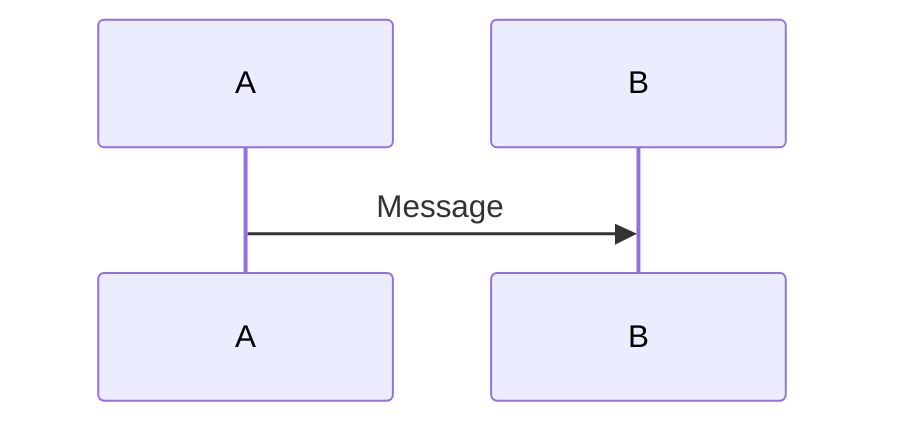

# Diagram Conventions

## Configuration

Check configuration before adding diagrams:
- `${config:eng-docs.include-diagrams}` — whether to include Mermaid diagrams at all
- `${config:eng-docs.diagram-syntax}` — which syntax to use

**If `include_diagrams: false`**, use simple text flow diagrams:
```
[Entry Point] → [Stage 1] → [Stage 2] → [Output]
```

## Mermaid Syntax

**`azure-devops`** (default):
```
::: mermaid
sequenceDiagram
    participant A
    A->>B: Message
:::
```

**`github`**:
````

````

## C4 Model Abstraction (Critical)

Follow the [C4 model](https://c4model.com/) — **never mix abstraction levels in one diagram:**

| Level | Shows | Elements | Lines Mean |
|-------|-------|----------|------------|
| **Container (C2)** | Deployable apps, data stores | APIs, DBs, queues, services | Network calls |
| **Component (C3)** | Internal structure of ONE container | Classes, modules, packages | In-process calls |

**Progressive Disclosure:** Provide both views when documenting a component:
1. **External View (C2)** — container interactions (what it does)
2. **Internal View (C3)** — component orchestration (how it works)

**Common mistake:** Showing `UserController` (C3) alongside `OrderService` (C2) — makes classes look like separate services.

## When to Offer Diagrams

- Complex flows (>5 stages)
- Multi-system interactions
- State transitions
- Architecture overviews

## When to Skip

- Simple linear flows already clear in text
- Would duplicate without adding value
- Reader didn't request it

## Diagram Types

| Type | Use When |
|------|----------|
| **Sequence** | Multi-service request/response flows |
| **Flowchart** | Decision logic, branching, state machines |
| **Text flow** | Simple linear pipelines |

**Rule:** Propose diagram structure before creating. Let the user control scope and detail.
