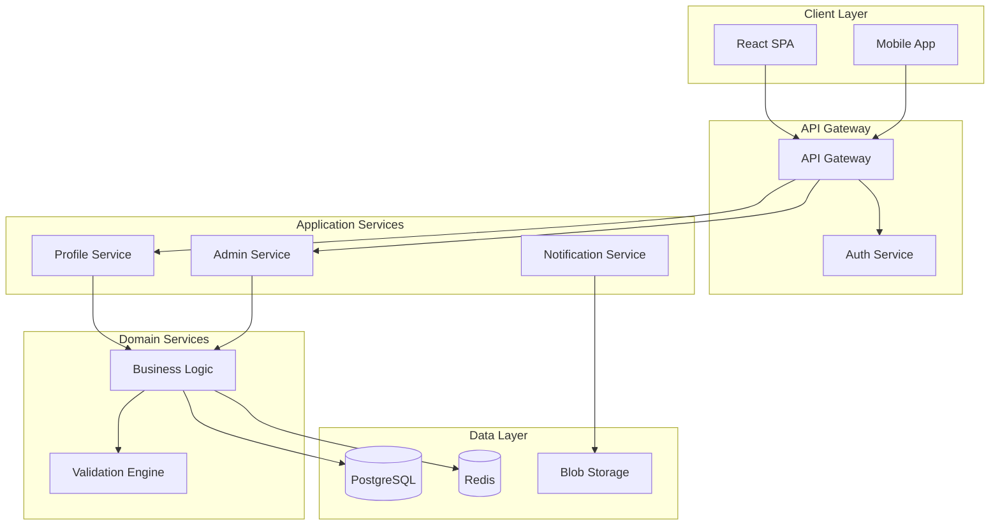

# Repository Overview — Architecture & Onboarding Document

Generate a **repository overview and architecture document** plus a contributor
**Team Playbook** for an unfamiliar codebase. This is the canonical entrypoint
for the `repository-overview` scenario.

## When to Use

- The user says "generate a repository overview", "document this codebase",
  "analyze the architecture", "onboard me to this repo", or "create
  architecture docs".
- A new contributor needs a high-level map of the project's structure, stack,
  components, and review culture before making changes.
- The agent should be `Octane.RepoAnalyst` (see
  [agents/Octane.RepoAnalyst.agent.md](../../agents/Octane.RepoAnalyst.agent.md)); it
  carries the declared model, the `code-search/*` + `ado-stdio/*` tool
  allow-list, and the step-compliance guarantees this skill depends on. If a
  different agent is active, this skill will delegate — see
  [Agent Delegation](#agent-delegation-mandatory).

## Inputs

| Parameter | Required | Description |
|-----------|----------|-------------|
| `OutputPath` | Optional | Destination for the overview document. Defaults to `./docs/repository_overview.md`. |
| `IncludeTeamPlaybook` | Optional | Whether to also generate `docs/team-playbook.md` (default: yes). The Team Playbook can also be produced standalone via the [`octane-team-playbook`](../octane-team-playbook/SKILL.md) skill. |

No source inputs are required — all repository context is gathered
automatically via the `code-search/*` tools and the local git remote.

## Agent Delegation (MANDATORY)

This skill is designed to run under the `Octane.RepoAnalyst` agent (see
[agents/Octane.RepoAnalyst.agent.md](../../agents/Octane.RepoAnalyst.agent.md)), which
carries the model declaration, the `code-search/*` + `ado-stdio/*` tool
allow-list, and the step-compliance + quality guarantees this skill's workflow
assumes.

**Before executing any step below, check the active agent:**

- **If the active agent IS `Octane.RepoAnalyst`** → proceed to `## Primary
  Directive`.
- **If the active agent is NOT `Octane.RepoAnalyst`** → you MUST delegate this
  skill's execution to `Octane.RepoAnalyst` instead of running it yourself. Use the
  host's agent-switching mechanism:
  - **VS Code Copilot Chat**: instruct the user to re-invoke under the target
    agent (e.g., `@Octane.RepoAnalyst /octane-repository-overview`) and stop.
  - **Copilot CLI**: re-invoke with `--agent Octane.RepoAnalyst` (e.g.,
    `copilot --agent Octane.RepoAnalyst -p "/octane-repository-overview"`) or
    launch `Octane.RepoAnalyst` as a sub-agent for this task and pass through the
    inputs.
  - **Any other host / orchestrator** (Conductor, A2A, etc.): dispatch to
    `Octane.RepoAnalyst` as a sub-agent and forward `OutputPath` and
    `IncludeTeamPlaybook`.

Do **not** silently execute the workflow under a generic or unrelated agent —
the multi-phase research and the mandatory template assume the `Octane.RepoAnalyst`
tool allow-list and step-compliance contract, and running them elsewhere may
fabricate results or skip required verification.

## Primary Directive

Generate a **repository overview and architecture document** for the
repository. The document must be:

- **Compliant** with the mandatory template format, structure, and guidelines.
- **Machine-readable** and structured for autonomous execution by AI systems or
  human teams.
- **Deterministic**, with no ambiguity or placeholder content.

Creating a comprehensive and well-structured overview is the foundation for all
downstream planning, design, and implementation activity. Follow the template
and steps below thoroughly to ensure completeness and clarity.

## Steps

Present the following steps as **trackable todos** to guide progress.

### 1. Deep Research

Use the `agent` tool to invoke an **Architecture Research sub-agent**: use the
`code-search/*` tools to examine the overall repository structure — key
directories, modules, and components. Analyze dependency files (`package.json`,
`requirements.txt`, `.csproj`, etc.) to extract exact versions and purposes.
Identify the high-level solution architecture, component interactions, and data
flow. Perform deep analysis of the technical stack — languages, frameworks,
libraries, design patterns, and infrastructure services. Describe the key
modules, their purpose, main functionalities, and how they fit into the overall
architecture. Respond with a structured summary of repository structure,
technical stack, architecture, and key modules.

### 2. Team Playbook

Use the `agent` tool to invoke a **Team Playbook sub-agent** that runs the
[`octane-team-playbook`](../octane-team-playbook/SKILL.md) skill: mine PR review
history (last 50 merged PRs, repo-scoped, all authors) and write the complete
playbook to `./docs/team-playbook.md`. Skip this step if `IncludeTeamPlaybook`
is set to no.

### 3. Application Components, Data Architecture & API Specifications

Use the `agent` tool to invoke three parallel sub-agents:

- **Application Components sub-agent**: use the `code-search/*` tools to
  identify and describe the major business and system components — their
  namespaces, key classes/interfaces, and how they interact to fulfill
  requirements.
- **Data Architecture sub-agent**: use the `code-search/*` tools to analyze
  data architecture — storage mechanisms, data models, access patterns,
  relationships, and any data flow diagrams.
- **API Specifications sub-agent**: use the `code-search/*` tools to document
  API specifications if the repository exposes any APIs — endpoints,
  request/response formats, authentication mechanisms, and integration points.

### 4. Draft the Document

- Synthesize findings from all sub-agents into a complete overview document.
- Follow the [Mandatory Template](#mandatory-template) with all required
  sections.
- Include mermaid diagrams where appropriate to illustrate architecture.
- Ensure all content is based on actual codebase analysis, not placeholders.

### 5. Review and Refine

Use the `agent` tool to invoke a review sub-agent that will:

- Critically review the drafted document for completeness, accuracy, and
  clarity.
- Use the `code-search/*` tools to verify key claims against the actual
  codebase.
- Validate that no major modules, components, or patterns were missed.
- Check for gaps in logic or missing information and make necessary
  adjustments.

## File Naming Convention

- **Location**: `OutputPath`, which defaults to
  `./docs/repository_overview.md`.

## Mandatory Template

```markdown
---
repository: [Repository Name]
version: [e.g., 1.0.0]
date_created: [YYYY-MM-DD]
last_updated: [YYYY-MM-DD]
owner: [Team/Individual responsible]
type: [e.g., Microservice, Monolith, Library, Full-Stack Application]
---

# Repository Overview

[Brief description of the repository's purpose, the problem it solves, and its role in the larger ecosystem.]

## 1. Technical Stack

**Summary**: [High-level overview of the technology choices and rationale]

### Core Technologies

| Category | Technology | Version | Purpose |
|----------|------------|---------|---------|
| **Runtime** | .NET | 8.0 | Backend services and APIs |
| **Language** | TypeScript | 5.x | Frontend application logic |
| **Framework** | React | 18.x | User interface components |
| **Database** | PostgreSQL | 15.x | Primary data storage |
| **Cache** | Redis | 7.x | Session and data caching |
| **Container** | Docker | 24.x | Application containerization |

### Infrastructure Services

| Service | Provider | Purpose | Configuration |
|---------|----------|---------|---------------|
| **Compute** | Azure App Service | Web application hosting | B2 tier, 2 instances |
| **Storage** | Azure Blob Storage | File and media storage | Hot tier, GRS |
| **Messaging** | Azure Service Bus | Async communication | Standard tier |
| **Monitoring** | Application Insights | APM and logging | Full telemetry |

## 2. Solution Architecture

**Summary**: [Describe the architectural pattern and key design decisions]

### System Components



### Architectural Patterns

| Pattern | Implementation | Rationale |
|---------|---------------|-----------|
| **Domain-Driven Design** | Bounded contexts for each business domain | Clear separation of concerns |
| **CQRS** | Separate read/write models | Optimized query performance |
| **Event Sourcing** | Event store for audit trail | Complete system history |
| **Repository Pattern** | Data access abstraction | Testability and flexibility |

## 3. Project Structure

**Summary**: [Overview of the repository organization and module structure]

### Directory Layout

```
/
├── src/
│   ├── Web/                 # Frontend React application
│   ├── API/                 # REST API endpoints
│   ├── Application/         # Application layer services
│   ├── Domain/              # Core business logic
│   ├── Infrastructure/      # External service integrations
│   └── Shared/              # Cross-cutting concerns
├── tests/
│   ├── Unit/                # Unit test projects
│   ├── Integration/         # Integration test projects
│   └── E2E/                 # End-to-end test suites
├── docs/                    # Technical documentation
├── scripts/                 # Build and deployment scripts
└── .github/                 # CI/CD workflows
```

### Key Modules

| Module | Path | Responsibility | Dependencies |
|--------|------|----------------|--------------|
| **Web.Client** | `/src/Web/` | User interface and client routing | React, Redux, Axios |
| **API.Gateway** | `/src/API/` | HTTP endpoints and request handling | ASP.NET Core, MediatR |
| **Application.Services** | `/src/Application/` | Use case orchestration | Domain, FluentValidation |
| **Domain.Core** | `/src/Domain/` | Business entities and rules | None (pure domain) |
| **Infrastructure.Data** | `/src/Infrastructure/` | Database and external services | EF Core, Azure SDK |

## 4. Application Components

**Summary**: [Description of the major functional components within the application]

### Business Components

| Component | Namespace | Description | Key Classes |
|-----------|-----------|-------------|-------------|
| **Authentication** | `App.Auth` | User identity and access control | `AuthService`, `TokenProvider`, `PermissionManager` |
| **Profile Management** | `App.Profile` | User profile and preferences | `ProfileService`, `UserRepository`, `ProfileValidator` |
| **Administration** | `App.Admin` | System configuration and management | `AdminService`, `ConfigManager`, `AuditLogger` |
| **Reporting** | `App.Reports` | Analytics and data visualization | `ReportEngine`, `DataAggregator`, `ExportService` |
| **Notifications** | `App.Notifications` | Multi-channel messaging | `NotificationHub`, `EmailSender`, `PushService` |

### System Components

| Component | Namespace | Description | Interfaces |
|-----------|-----------|-------------|------------|
| **Domain Layer** | `Domain` | Core business logic and entities | `IEntity`, `IAggregateRoot`, `IRepository` |
| **Application Layer** | `Application` | Application services and DTOs | `IApplicationService`, `IValidator`, `IMapper` |
| **Infrastructure Layer** | `Infrastructure` | External service implementations | `IDbContext`, `IMessageBus`, `IFileStorage` |
| **Cross-Cutting** | `Shared` | Shared utilities and helpers | `ILogger`, `ICacheService`, `IDateTimeProvider` |

## 5. Data Architecture

**Summary**: [Overview of data storage, models, and access patterns]

### Data Models

| Entity | Table/Collection | Description | Relationships |
|--------|-----------------|-------------|---------------|
| **User** | `users` | System user accounts | Has many Profiles, Roles |
| **Profile** | `profiles` | User profile information | Belongs to User |
| **Role** | `roles` | Authorization roles | Many to many with Users |
| **AuditLog** | `audit_logs` | System activity tracking | Polymorphic associations |
| **Configuration** | `configurations` | System settings | Standalone |

### Data Access Patterns

| Pattern | Implementation | Use Case |
|---------|---------------|----------|
| **Repository** | Generic repository with specifications | Standard CRUD operations |
| **Unit of Work** | Transaction management per request | Consistency across operations |
| **Query Objects** | Encapsulated complex queries | Reporting and analytics |
| **Caching Strategy** | Redis with cache-aside pattern | High-frequency reads |

## 6. API Specifications

**Summary**: [Overview of API design and endpoints]

### API Endpoints

| Endpoint | Method | Purpose | Authentication |
|----------|--------|---------|----------------|
| `/api/auth/login` | POST | User authentication | None |
| `/api/users/{id}` | GET | Retrieve user details | Bearer token |
| `/api/profiles` | GET/POST/PUT | Profile management | Bearer token |
| `/api/admin/*` | ALL | Administrative operations | Admin role |
| `/api/reports/{type}` | GET | Generate reports | Bearer token |

### Integration Points

| System | Protocol | Direction | Purpose |
|--------|----------|-----------|---------|
| **Payment Gateway** | REST/HTTPS | Outbound | Payment processing |
| **Email Service** | SMTP/API | Outbound | Email notifications |
| **Identity Provider** | OAuth2/OIDC | Bidirectional | SSO authentication |
| **Analytics Platform** | Event streaming | Outbound | Usage analytics |

---

*Last Updated: [Date]*
```

> The table rows above are illustrative examples — replace every value with
> findings from the actual codebase analysis. Do not ship example data.

## Example

```text
/octane-repository-overview
```

Produces `docs/repository_overview.md` (technical stack, architecture diagrams,
module map, components, data model, API spec) and, by default,
`docs/team-playbook.md`.

## Output

- `docs/repository_overview.md` — the complete, template-compliant architecture
  document.
- `docs/team-playbook.md` — the contributor Team Playbook (unless
  `IncludeTeamPlaybook` is set to no).

This skill never modifies the user's source code; it only writes documentation
under `docs/`.
