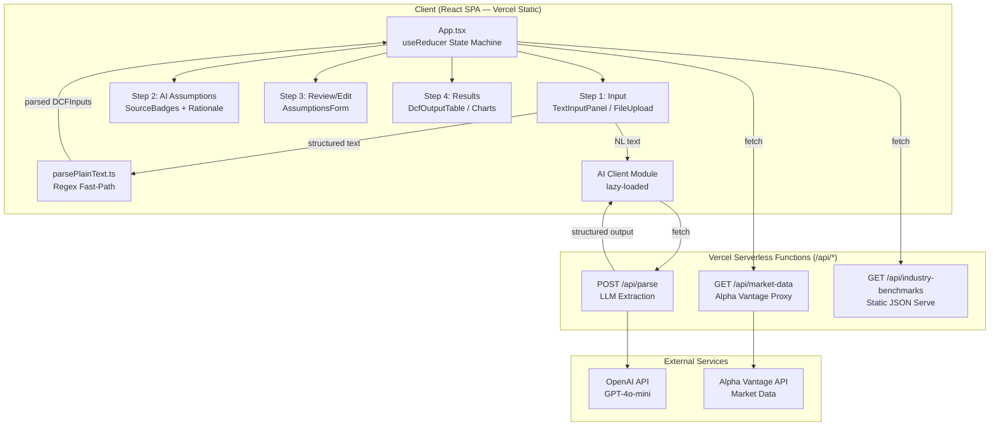
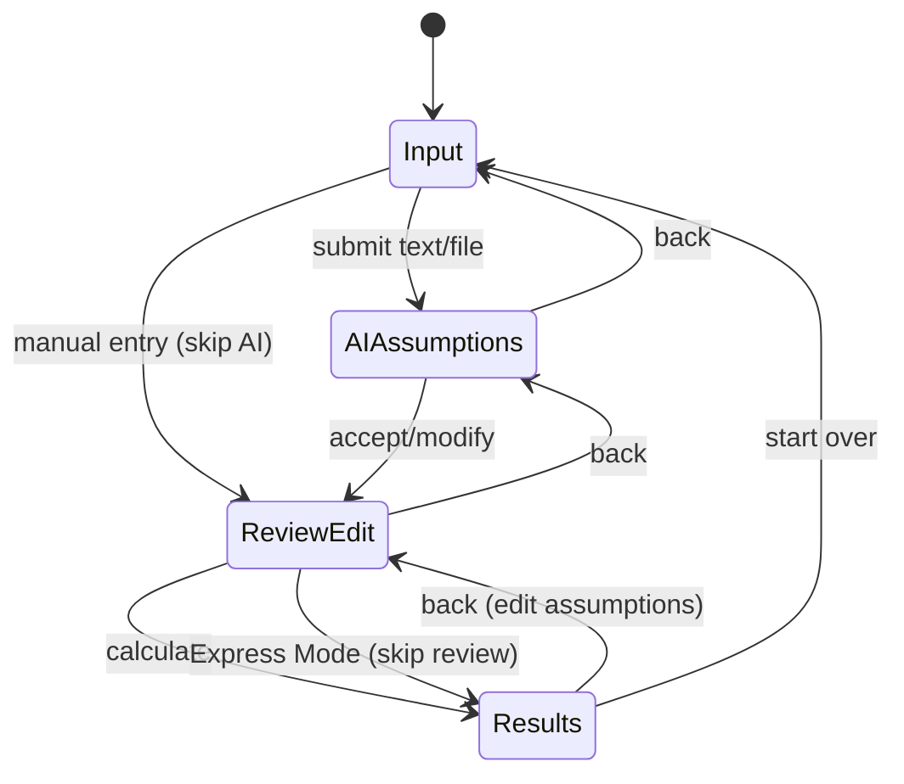
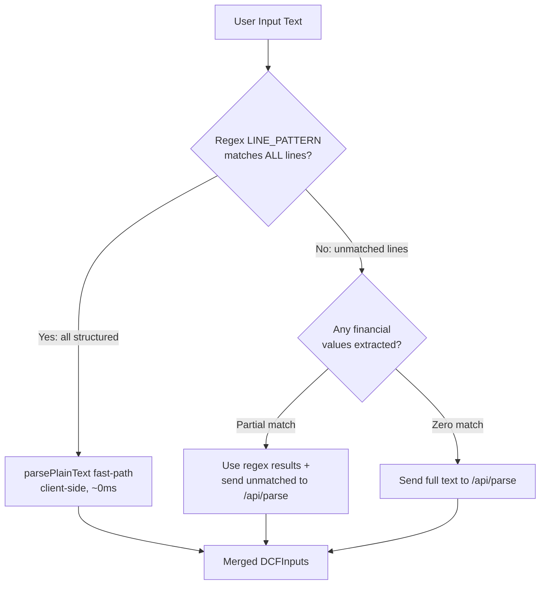

# Introduction

This Product Requirements Document defines the implementation plan for transforming the existing static DCF Model Builder — a React 18 + TypeScript SPA deployed on Vercel — into an AI-powered financial analysis platform. The platform will accept natural-language company descriptions, leverage server-side LLM parsing via Vercel Serverless Functions, auto-retrieve market data without user-supplied API keys, provide industry benchmark defaults, and guide users through a structured 4-step workflow (Input → AI Assumptions → Review/Edit → Results).

The existing pure-function calculation engine (`dcfCalculations.ts`, `assumptionEngine.ts`, `validation.ts`, `exportResults.ts`) is validated and tested — it MUST NOT be modified (CON-003). New features are additive layers: serverless API endpoints, new client components, extended types, and a refactored state machine in `App.tsx`.

The key words "MUST", "MUST NOT", "REQUIRED", "SHALL", "SHALL NOT", "SHOULD", "SHOULD NOT", "RECOMMENDED", "MAY", and "OPTIONAL" in this document are to be interpreted as described in RFC 2119.

**Cross-reference conventions**: This document uses standardized prefixes for traceability — `FR-` (functional requirements from `.req.md`), `NFR-` (non-functional requirements from `.req.md`), `FM-` (failure modes from `.req.md`), `AC-` (acceptance criteria from `.req.md`), `ASM-` (assumptions from `.req.md`), `ALT-` (alternatives from `.req.md`), `US-` (user stories from `.req.md`), `CON-` (constraints from `.req.md`), `RSK-` (risks from `.req.md`), `REQ-` (plan-level requirements), `SEC-` (security), `GUD-` (guidelines), `PAT-` (patterns), `FILE-` (files affected), `EPIC-` (epics), `ITEM-` (work items).

## 1. Goals and Non-Goals

- **Goal 1**: Accept a single natural-language sentence and produce a complete DCF valuation with all fields populated via AI + market data + industry benchmarks
- **Goal 2**: Eliminate user-supplied API keys — all external data retrieval happens server-side with secrets in Vercel environment variables
- **Goal 3**: Provide a guided 4-step workflow (Input → AI Assumptions → Review/Edit → Results) replacing the binary landing/workspace view
- **Goal 4**: Deliver transparent, source-attributed assumptions (AI-inferred, market-data, industry-benchmark, user-provided, default) with editable overrides
- **Goal 5**: Maintain bundle <200KB gzipped and preserve existing Vercel deployment with zero infrastructure migration
- **Goal 6**: Preserve all existing validated pure utilities unchanged (CON-003)

- **Non-Goal 1**: User authentication or saved session history
- **Non-Goal 2**: PDF/Excel export enhancements
- **Non-Goal 3**: "Explain my valuation" AI feature
- **Non-Goal 4**: Best/worst scenario analysis beyond existing probability-weighted scenarios
- **Non-Goal 5**: IRR calculation (NPV maps to existing enterpriseValue/equityValue per ASM-005)
- **Non-Goal 6**: Migration away from Vercel or to Next.js

### In Scope

- Vercel Serverless Functions (`/api/*` routes) co-deployed with SPA
- `POST /api/parse` — LLM-powered natural language → structured DCFInputs extraction
- `GET /api/market-data` — server-side Alpha Vantage proxy (key in env var)
- `GET /api/industry-benchmarks` — curated static dataset serving
- Hybrid parsing: regex fast-path (existing `parsePlainText`) + server-side LLM fallback
- 4-step `useReducer` state machine in App.tsx (no React Router)
- Industry benchmark dataset (≥10 industries) as static JSON
- Assumption source metadata and transparency UI
- Removal of `SettingsPanel` API key input and `localStorage('dcf.apiKey')`
- Loading states, progress indicators, responsive feedback
- UI/UX improvements: nav bar, step indicator, typography scale, valuation highlights

### Out of Scope (deferred)

- User accounts / authentication
- Save/revisit analysis history
- PDF/Excel export
- "Explain my valuation" AI feature
- Scenario analysis (best/worst beyond existing)
- Mobile-native applications
- Multi-user collaboration

## 2. Terminology

| Term | Definition |
|------|------------|
| Serverless Function | A Vercel-hosted Node.js function triggered by HTTP requests to `/api/*` routes; scales to zero when idle |
| Hybrid Parsing | Architecture where structured input is parsed client-side via regex (fast-path) and unstructured NL input falls back to server-side LLM |
| Industry Benchmark | Curated static financial metrics (margins, growth, beta ranges) for major industry categories |
| Source Attribution | Metadata on each assumption indicating its origin (AI-inferred, market-data, industry-benchmark, user-provided, default) |
| State Machine | A `useReducer`-based 4-step workflow controller managing transitions between Input, AI Assumptions, Review, and Results |
| Express Mode | Optional workflow shortcut that skips the Review/Edit step for users who trust AI defaults |

## 3. Solution Architecture

### High-Level System Architecture



### Request Flows

**POST /api/parse** (NL → structured assumptions):
1. Client sends `{ text: string, industry?: string }` (max 2000 chars)
2. Serverless function validates input length, sanitizes
3. Calls OpenAI GPT-4o-mini with structured output (function-calling) at temperature 0
4. LLM returns extracted financial parameters + confidence + rationale per field
5. Server-side validation layer checks plausibility ranges (FM-003/FM-007): rates as decimals, growth ≤100%, margins within [-50%, 90%]
6. Unit normalization: ensures all rates are decimal form per CON-005
7. Returns `{ assumptions: Partial<DCFInputs>, metadata: AssumptionMetadata[], followUp?: string[] }`

**GET /api/market-data?ticker=X**:
1. Client sends ticker symbol
2. Serverless function reads `ALPHAVANTAGE_API_KEY` from env
3. Calls Alpha Vantage OVERVIEW (beta) + TREASURY_YIELD (risk-free rate) endpoints with retry (max 3, exponential backoff per NFR-002.3)
4. Returns `{ data: { beta, riskFreeRate, equityRiskPremium }, source, retrievedAt }` or graceful fallback with `source: 'default'`
5. Response cached with TTL (1 hour for treasury yields per NFR-006.2)

**GET /api/industry-benchmarks?industry=X**:
1. Client sends industry classification string
2. Serverless function reads curated JSON dataset, fuzzy-matches industry
3. Returns benchmark values: `{ revenueGrowth, operatingMargin, dAndARate, capExRate, nwcRate, costOfDebt, betaRange }`
4. Cache TTL: 24 hours (static data per NFR-006.2)

### 4-Step useReducer State Machine



State shape:
```typescript
type WorkflowStep = 'input' | 'ai-assumptions' | 'review' | 'results';
type WorkflowAction =
  | { type: 'SUBMIT_INPUT'; payload: { text: string; mode: 'nl' | 'structured' | 'file' } }
  | { type: 'AI_COMPLETE'; payload: { assumptions: Partial<DCFInputs>; metadata: AssumptionMetadata[] } }
  | { type: 'ACCEPT_ASSUMPTIONS' }
  | { type: 'EXPRESS_MODE' }
  | { type: 'CALCULATE' }
  | { type: 'BACK' }
  | { type: 'START_OVER' };
```

### Hybrid Parse Flow



### Bundle Protection (CON-001)

The AI client module (fetch wrapper for `/api/parse`) is lazy-loaded via dynamic `import()` only when NL input mode is selected (FR-008.6). The serverless functions are NOT in the client bundle. Heavy lifting (LLM calls, market data fetching) is server-side. The initial bundle adds only: useReducer state machine logic (~2KB), step UI components (~8KB), source badge components (~3KB), industry benchmark type definitions (~1KB). Total new client code budget: ~14KB uncompressed → ~4KB gzipped, well within the ~142KB remaining headroom.

## 4. Design Decisions

| ID | Decision | Rationale | Traces To |
|----|----------|-----------|-----------|
| DD-001 | Vercel Serverless Functions for backend (`/api/*` routes) co-deployed with SPA | Zero infrastructure migration; native Vercel integration; scales to zero; `vercel.json` extended with `/api` routes alongside SPA rewrites | ALT-001, ASM-001 |
| DD-002 | Hybrid parser: regex fast-path + server-side LLM fallback | Preserves instant response for structured input; AI handles true NL; two code paths but clear routing logic | ALT-002, FR-004 |
| DD-003 | OpenAI GPT-4o-mini with structured output, temperature 0 | Lowest cost ($0.15/1M input); function-calling ensures reliable JSON; temperature 0 maximizes determinism for financial extraction | ASM-002, NFR-002.1 |
| DD-004 | Server-side Alpha Vantage proxy (key in env var) | Reuses existing proven `researchApi.ts` logic; minimal code change; key hidden from client | ALT-003, ASM-006, FR-007.5 |
| DD-005 | `useReducer` 4-step state machine in App.tsx | No new dependencies; colocated with existing state; testable; simpler than React Router for non-URL-routed steps | ALT-004, FR-006.1 |
| DD-006 | Incremental evolution, NOT rewrite | Preserves tested business logic; new code layers on top; reduces risk; shippable in phases | ALT-005, ASM-003, CON-003 |
| DD-007 | NPV maps to existing enterpriseValue/equityValue; IRR out of scope | Current engine computes EV which IS the NPV of future cash flows; IRR requires different framing not present in codebase | ASM-005 |
| DD-008 | Industry benchmarks as curated static JSON | No reliable free API for comprehensive industry benchmarks; curated data ensures quality; avoids external dependency | ASM-007, FR-003.1 |
| DD-009 | No user authentication | Stateless/anonymous; simplifies architecture; rate limiting via IP/session tokens | ASM-004 |

## 5. Requirements

**Items**:
- **REQ-001**: All serverless functions MUST be pure request handlers (input → validate → process → respond) testable with Vitest without HTTP server (traces to NFR-004, FR-007)
- **REQ-002**: The LLM provider MUST be abstracted behind an interface allowing swap without client changes (traces to NFR-004.1)
- **REQ-003**: The market data provider MUST be abstracted behind an interface allowing swap without client changes (traces to NFR-004.2)
- **REQ-004**: Every AI-generated assumption MUST carry source metadata: `{value, source, confidence, rationale}` (traces to FR-003.3, NFR-003.1)
- **REQ-005**: The 4-step workflow MUST preserve all user data on backward navigation (traces to FR-006.6, AC-011)
- **REQ-006**: The hybrid parser MUST route unmatched lines to `/api/parse` instead of returning errors (traces to FR-004.2, AC-017)
- **REQ-007**: All financial rates MUST be stored as decimals per existing convention (traces to CON-005, FM-007)
- **CON-001**: Initial JS bundle MUST remain <200KB gzipped; AI client module lazy-loaded (traces to FR-008.1, FM-005)
- **CON-002**: Deployment MUST remain on Vercel; serverless functions co-deployed (traces to CON-002 REQ)
- **CON-003**: Existing pure utilities (`dcfCalculations.ts`, `assumptionEngine.ts`, `validation.ts`, `exportResults.ts`) MUST NOT be modified (traces to CON-003 REQ, NFR-004.4)
- **CON-004**: TypeScript strict mode; no `any` types (traces to CON-004 REQ)
- **CON-005**: React 18.3.1 functional components + hooks only (traces to CON-006 REQ)
- **CON-006**: Tailwind CSS only for styling (traces to CON-007 REQ)
- **GUD-001**: Serverless function handlers SHOULD be thin orchestrators calling imported pure logic modules for testability
- **GUD-002**: New components SHOULD follow single-responsibility; logic separated from presentation
- **GUD-003**: API error responses SHOULD use consistent shape `{ error: string, fallback?: object }`
- **PAT-001**: Client → Server: `fetch('/api/...', { method, body, headers })` with timeout + retry
- **PAT-002**: Server validation: input length check → sanitize → process → validate output ranges → respond
- **PAT-003**: Graceful degradation: if server unavailable, fall back to enhanced regex + defaults with notice
- **SEC-001**: No API keys, secrets, or tokens in client bundle or repository (traces to NFR-005.1, FR-007.5)
- **SEC-002**: Server-side input validation: text max 2000 chars, ticker max 10 chars alphanumeric only (traces to NFR-005.2)
- **SEC-003**: Rate limiting on all `/api/*` endpoints to prevent abuse (traces to NFR-005.3, FM-008)
- **SEC-004**: CORS restricted to production domain(s) (traces to NFR-005.4)
- **SEC-005**: Environment variables (`OPENAI_API_KEY`, `ALPHAVANTAGE_API_KEY`) stored only in Vercel project settings, never committed

## 6. Risk Classification

**Risk**: 🟡 MEDIUM

This initiative introduces server-side code (Vercel Serverless Functions), external service dependencies (OpenAI, Alpha Vantage), and significant UI restructuring. Mitigations include: graceful degradation for service unavailability, rate limiting for cost control, validation layers for LLM output, and incremental delivery (each epic independently shippable).

**Items**:
- **RISK-001**: LLM non-determinism produces inconsistent valuations — mitigated by temperature=0, validation ranges, deterministic post-processing (traces to RSK-001)
- **RISK-002**: Vercel serverless cold starts degrade UX (1-3s first request) — mitigated by loading states, consider Edge Functions for simple endpoints (traces to RSK-002, FM-006)
- **RISK-003**: LLM cost exceeds budget at scale — mitigated by GPT-4o-mini selection, rate limiting, caching, budget alerts (traces to RSK-003, FM-008)
- **RISK-004**: Alpha Vantage free tier rate limits (5 calls/min) — mitigated by aggressive caching (1h TTL), consider paid tier (traces to RSK-004)
- **RISK-005**: Bundle size creep from AI client utilities — mitigated by lazy-loading, server-side heavy logic, CI size check (traces to RSK-005, FM-005)
- **RISK-006**: LLM hallucinates plausible-but-wrong financial data — mitigated by validation bounds, require user review step (Step 3), confidence scoring (traces to RSK-006, FM-003)

## 7. Dependencies

**Items**:
- **DEP-001**: OpenAI API (GPT-4o-mini) — LLM provider for NL parsing; fallback to regex + defaults if unavailable
- **DEP-002**: Alpha Vantage API — market data provider; fallback to cached/defaults if unavailable
- **DEP-003**: Vercel Serverless Functions runtime — platform for `/api/*` routes; blocking if unavailable
- **DEP-004**: `openai` npm package — server-side only, for structured output calls
- **DEP-005**: Existing validated utilities (dcfCalculations, assumptionEngine, validation, exportResults) — unchanged dependencies

## 8. Quality & Testing

**Strategy**: Serverless function handlers are structured as thin HTTP wrappers calling imported pure logic modules. The pure logic (LLM prompt construction, response parsing, validation, normalization) is testable with Vitest in Node environment without HTTP servers. Client components have limited unit tests (Vitest node env limitation for DOM); integration tested manually and via E2E scenarios.

**Items**:
- **TEST-001**: Unit test LLM response parser — verify structured output → `Partial<DCFInputs>` + metadata mapping with mock responses (3+ cases: complete extraction, partial, empty)
- **TEST-002**: Unit test plausibility validator — verify range checks flag unrealistic values (growth >100%, negative rates, non-decimal percentages) per FM-003/FM-007
- **TEST-003**: Unit test unit normalizer — verify percentage-to-decimal conversion, suffix handling (M/B/K), currency stripping
- **TEST-004**: Unit test market data response parser — verify Alpha Vantage JSON → `ResearchDataSource` mapping with mock responses
- **TEST-005**: Unit test industry benchmark lookup — verify fuzzy matching returns correct benchmarks for each of ≥10 industries
- **TEST-006**: Unit test hybrid parse routing — verify structured input stays client-side, NL input routes to API, mixed input partially routes
- **TEST-007**: Integration test — NL sentence → `/api/parse` → valid `DCFInputs` with all required fields populated (known-answer test)
- **TEST-008**: E2E validation — single sentence "A mid-size SaaS company growing 30% YoY with 70% gross margins" → complete DCF with non-zero EV/equity value
- **TEST-009**: Bundle size CI check — `vite build` output < 200KB gzipped

## 9. Deployment

**Strategy**: Vercel Serverless Functions co-deploy with the SPA via the existing Git integration. The `/api/*` routes are served by Vercel's serverless runtime; all other routes fall through to the SPA `index.html` rewrite.

**Configuration**:
- `vercel.json`: Add `/api/**` route handling (Vercel auto-detects `api/` directory) alongside existing SPA rewrite. The SPA rewrite `/(.*) → /index.html` MUST NOT match `/api/*` — Vercel's built-in API routing takes precedence.
- Environment Variables (Vercel Project Settings):
  - `OPENAI_API_KEY` — OpenAI API key for GPT-4o-mini
  - `ALPHAVANTAGE_API_KEY` — Alpha Vantage API key (moved from client localStorage)
- Rate Limiting: Implemented in serverless function code (in-memory counter per IP with sliding window; consider Vercel KV for distributed state at scale)
- CORS: `Access-Control-Allow-Origin` set to production domain only; reject other origins
- Cold Start Mitigation: Keep functions small (<50KB); minimize dependencies; display loading states client-side within 200ms

**Rollback**: Revert Git commit and push to `main` — Vercel auto-redeploys previous version. Serverless functions and SPA are atomically deployed together.

## 10. Resolved Decisions

| ID | Decision | Rationale | Traces To |
|----|----------|-----------|-----------|
| RD-001 | Backend = Vercel Serverless Functions, NOT Next.js, NOT separate service | Zero migration; co-deployed with SPA; native Vercel integration; `vercel.json` extended with `/api` | ALT-001, ASM-001 |
| RD-002 | Hybrid parser: regex fast-path (reuse existing `parsePlainText`) + server-side LLM fallback | Preserves instant structured parsing; AI for NL; eliminates "unrecognized line" errors | ALT-002, FR-004 |
| RD-003 | LLM = OpenAI-compatible GPT-4o-mini, structured output, temperature 0 | Cost-effective; reliable JSON via function-calling; deterministic financial extraction | ASM-002 |
| RD-004 | Market data via server-side proxy reusing Alpha Vantage logic, key in env var | Minimal code change; proven endpoints; key hidden from client | ALT-003, ASM-006 |
| RD-005 | Workflow = `useReducer` 4-step state machine in App.tsx (no React Router, no wizard lib) | No new dependencies; testable; colocated state | ALT-004 |
| RD-006 | Incremental evolution, NOT rewrite; pure utils untouched | Preserves validated business logic; reduces risk; CON-003 compliance | ALT-005, ASM-003 |
| RD-007 | NPV = existing enterpriseValue/equityValue; IRR out of scope | EV IS NPV of future cash flows; IRR not in codebase, not requested | ASM-005 |
| RD-008 | Industry benchmarks = curated static JSON maintained by devs | No reliable free API; quality control; no external dependency | ASM-007 |

## 11. Alternatives Considered

| Alternative | Pros | Cons | Decision |
|-------------|------|------|----------|
| Next.js App Router migration | Built-in API routes; SSR; modern patterns | Full rewrite; loses tested code; complex migration; overkill | Rejected (RD-001) |
| Separate Express backend on Railway/Fly.io | Full control; no execution limits | Separate deployment; CORS; ops burden; cost at idle | Rejected (RD-001) |
| Client-side LLM (WebLLM/WASM) | No server; privacy | Huge bundle; slow; poor quality; no secret protection | Rejected (RD-001) |
| Enhanced regex only (no LLM) | No server; instant; deterministic | Cannot handle NL; limited; still fails on creative input | Rejected (RD-002) |
| React Router for workflow | Deep-linkable; browser back/forward | New dependency; routing complexity; bundle increase | Rejected (RD-005) |
| Full rewrite with new architecture | Clean start | High risk; loses tested code; longer timeline | Rejected (RD-006) |

## 12. Files Affected

| ID | File Path | Change Type | Description | Traces To |
|----|-----------|-------------|-------------|-----------|
| FILE-001 | `api/parse.ts` | Create | Serverless function: LLM-powered NL → structured DCFInputs extraction | FR-007.2, FR-001 |
| FILE-002 | `api/market-data.ts` | Create | Serverless function: Alpha Vantage proxy for beta, risk-free rate, ERP | FR-007.3, FR-002 |
| FILE-003 | `api/industry-benchmarks.ts` | Create | Serverless function: serve curated industry benchmark data | FR-007.4, FR-003 |
| FILE-004 | `api/lib/llmProvider.ts` | Create | LLM provider abstraction (interface + OpenAI implementation) | REQ-002, NFR-004.1 |
| FILE-005 | `api/lib/marketDataProvider.ts` | Create | Market data provider abstraction (interface + Alpha Vantage implementation) | REQ-003, NFR-004.2 |
| FILE-006 | `api/lib/validation.ts` | Create | Server-side input validation + plausibility range checks for LLM output | SEC-002, FM-003, FM-007 |
| FILE-007 | `api/lib/rateLimiter.ts` | Create | Rate limiting middleware (per-IP sliding window) | SEC-003, NFR-005.3, FM-008 |
| FILE-008 | `api/lib/cors.ts` | Create | CORS header utility restricted to production domain(s) | SEC-004, NFR-005.4 |
| FILE-009 | `src/data/industryBenchmarks.ts` | Create | Curated static JSON dataset with ≥10 industry benchmarks | FR-003.1, ASM-007 |
| FILE-010 | `src/models/aiTypes.ts` | Create | TypeScript types for AI responses, assumption metadata, workflow state, source attribution | FR-003.3, REQ-004 |
| FILE-011 | `src/utils/aiClient.ts` | Create | Lazy-loadable client module: fetch wrapper for `/api/parse` with timeout + retry | FR-008.6, CON-001 |
| FILE-012 | `src/utils/marketDataClient.ts` | Create | Client fetch wrapper for `/api/market-data` replacing direct Alpha Vantage calls | FR-007.7 |
| FILE-013 | `src/utils/hybridParser.ts` | Create | Orchestrates regex fast-path → LLM fallback routing logic | FR-004.1, FR-004.2, ALT-002 |
| FILE-014 | `src/components/WorkflowStepIndicator.tsx` | Create | Visual step progress indicator (4 steps) | FR-005.2, AC-010 |
| FILE-015 | `src/components/InputStep.tsx` | Create | Step 1 component: NL text area, structured text, file upload entry | FR-006.2 |
| FILE-016 | `src/components/AIAssumptionsStep.tsx` | Create | Step 2 component: display AI-generated assumptions with source badges, batch accept/reject | FR-006.3, AC-013 |
| FILE-017 | `src/components/ReviewStep.tsx` | Create | Step 3 component: full editable AssumptionsForm with market data, warnings | FR-006.4 |
| FILE-018 | `src/components/ResultsStep.tsx` | Create | Step 4 component: DcfOutputTable, SensitivityTable, Charts, export | FR-006.5 |
| FILE-019 | `src/components/SourceBadge.tsx` | Create | Badge component showing assumption source type with tooltip rationale | AC-013, AC-014, NFR-003.1 |
| FILE-020 | `src/components/LoadingState.tsx` | Create | Loading skeleton/spinner with processing stage indicator | AC-021, AC-022, FR-008.4 |
| FILE-021 | `src/App.tsx` | Modify | Replace `useState` view/mode with `useReducer` 4-step state machine; remove SettingsPanel import; add workflow orchestration; add nav bar | FR-006.1, FR-007.6, DD-005 |
| FILE-022 | `src/models/financialTypes.ts` | Modify | Extend `ResearchDataSource` to include `rationale` field; add `AssumptionSource` union type (`'industry-benchmark'\|'ai-inferred'\|'market-data'\|'user-provided'\|'default'`) | FR-003.3, FR-003.5 |
| FILE-023 | `vercel.json` | Modify | Vercel auto-detects `api/` directory; no rewrite changes needed (built-in API routing takes precedence over SPA catch-all) | FR-007.1, DD-001 |
| FILE-024 | `package.json` | Modify | Add `openai` dependency (server-side only, not bundled in client) | DEP-004 |
| FILE-025 | `.env.example` | Create | Document required environment variables (no actual secrets) | SEC-005 |
| FILE-026 | `src/components/SettingsPanel.tsx` | Delete | Remove API key input UI; keys are now server-side env vars | FR-007.6, AC-005 |
| FILE-027 | `tests/apiParse.test.ts` | Create | Unit tests for `/api/parse` handler logic (mock LLM responses) | TEST-001, TEST-002, TEST-003 |
| FILE-028 | `tests/marketDataProvider.test.ts` | Create | Unit tests for market data provider + response parser | TEST-004 |
| FILE-029 | `tests/industryBenchmarks.test.ts` | Create | Unit tests for benchmark lookup + fuzzy matching | TEST-005 |
| FILE-030 | `tests/hybridParser.test.ts` | Create | Unit tests for hybrid parse routing logic | TEST-006 |
| FILE-031 | `src/utils/researchApi.ts` | Modify | Mark as deprecated/legacy; client no longer calls Alpha Vantage directly (logic moved to `api/lib/marketDataProvider.ts`) | FR-007.7, DD-004 |

## 13. Simplicity Rationale

- **Scope justification**: Every EPIC traces directly to functional requirements from the REQ. No epic exists for purely structural reasons without a direct requirement trace. The 10 epics decompose the initiative into independently shippable increments.
- **Abstractions check**: Two new abstractions are introduced — `LLMProvider` interface (REQ-002/NFR-004.1 mandates swappable LLM) and `MarketDataProvider` interface (REQ-003/NFR-004.2 mandates swappable data source). Both are explicitly required by non-functional requirements. No factories, strategy patterns, DI containers, or base classes are introduced.
- **Configuration check**: No feature flags. Configuration is limited to: environment variables (required for secrets), industry benchmark JSON (required by FR-003.1), and the existing `defaultAssumptions.ts`. No new config files beyond `.env.example`.
- **CON-003 compliance**: The four protected files (`dcfCalculations.ts`, `assumptionEngine.ts`, `validation.ts`, `exportResults.ts`) appear in ZERO FILE- entries as modified. New code layers on top via new modules and extended types.
- **Could this be simpler?**: The simplest approach would be a single serverless function doing everything. This was rejected because: (1) it violates single-responsibility making testing harder, (2) it doesn't allow independent caching strategies per endpoint, (3) it doesn't support the provider abstraction NFR-004 requires. The chosen 3-endpoint architecture is the minimum that satisfies all requirements while remaining testable and maintainable.

## 14. Implementation Plan

### EPIC-001: Serverless Scaffold + Shared Types + Vercel Configuration ✅ DONE

**Goal**: Establish the Vercel Serverless Functions infrastructure, shared type definitions, environment variable wiring, and verify `/api` routes coexist with the SPA.

**Traces to**: FR-007.1, FR-007.5, ASM-001, ALT-001, SEC-001, SEC-005, DD-001

| Task | Description | Status | Files |
|------|-------------|--------|-------|
| ITEM-001 | Create `api/` directory at project root (Vercel convention). Create `api/health.ts` as a minimal GET handler returning `{ status: 'ok', timestamp }` to verify serverless function deployment works. Export default function with `(req: VercelRequest, res: VercelResponse)` signature. | Done | api/health.ts |
| ITEM-002 | Create `api/lib/cors.ts`: utility function `applyCors(req, res)` that sets `Access-Control-Allow-Origin` to `process.env.ALLOWED_ORIGIN \|\| '*'`, handles OPTIONS preflight, returns boolean (true = preflight handled, caller should return). | Done | api/lib/cors.ts |
| ITEM-003 | Create `api/lib/rateLimiter.ts`: in-memory sliding window rate limiter. `checkRateLimit(ip: string, limit?: number, windowMs?: number): { allowed: boolean, remaining: number }`. Default 20 requests/minute per IP. Export utility. | Done | api/lib/rateLimiter.ts |
| ITEM-004 | Create `api/lib/validation.ts`: server-side input validators. `validateParseInput(body: unknown): { valid: true, text: string, industry?: string } \| { valid: false, error: string }` — checks text exists, length 1-2000, string type. `validateTickerInput(query: unknown): { valid: true, ticker: string } \| { valid: false, error: string }` — alphanumeric, 1-10 chars. | Done | api/lib/validation.ts |
| ITEM-005 | Create `src/models/aiTypes.ts`: TypeScript types — `AssumptionSource` union type, `AssumptionMetadata` interface (`{ field, value, source, confidence, rationale }`), `WorkflowStep` type, `WorkflowState` interface, `WorkflowAction` discriminated union, `ParseResponse` interface, `MarketDataResponse` interface, `IndustryBenchmark` interface. | Done | src/models/aiTypes.ts |
| ITEM-006 | Create `.env.example` documenting required environment variables: `OPENAI_API_KEY`, `ALPHAVANTAGE_API_KEY`, `ALLOWED_ORIGIN`. Add `.env` and `.env.local` to `.gitignore` if not already present. | Done | .env.example, .gitignore |

---

### EPIC-002: Industry Benchmark Dataset + Types

**Goal**: Create the curated industry benchmark dataset covering ≥10 major industries with financial metrics, and the lookup logic with fuzzy matching.

**Traces to**: FR-003.1, FR-003.2, ASM-007, DD-008

| Task | Description | Status | Files |
|------|-------------|--------|-------|
| ITEM-007 | Create `src/data/industryBenchmarks.ts`: export `INDUSTRY_BENCHMARKS` constant — an array of `IndustryBenchmark` objects for ≥10 industries (SaaS, Manufacturing, Retail, Healthcare, Fintech, Energy, Consumer Goods, Real Estate, Telecom, Media). Each entry includes: `industry` name, `aliases` array, `revenueGrowthRate` (decimal), `operatingMarginRate` (decimal), `dAndARate`, `capExRate`, `nwcRate`, `costOfDebt`, `betaRange: { low, mid, high }`. All rates as decimals per CON-005. | Done | src/data/industryBenchmarks.ts |
| ITEM-008 | Add `lookupBenchmark(industry: string): IndustryBenchmark \| undefined` function to the same file: case-insensitive fuzzy match against `industry` name and `aliases` array. Returns best match or undefined. | Done | src/data/industryBenchmarks.ts |
| ITEM-009 | Create `api/industry-benchmarks.ts`: GET handler that reads `industry` query param, calls `lookupBenchmark`, returns JSON benchmark or 404 with `{ error: 'Industry not found', available: string[] }`. Apply CORS + rate limiting. | Done | api/industry-benchmarks.ts |
| ITEM-010 | Create `tests/industryBenchmarks.test.ts`: verify ≥10 industries exist; verify fuzzy matching (e.g., "saas" matches "SaaS", "software" matches "SaaS"); verify all rates are valid decimals in [0,1]; verify unknown industry returns undefined. | Done | tests/industryBenchmarks.test.ts |

---

### EPIC-003: Market Data Proxy Endpoint ✅

**Status**: Done

**Goal**: Move Alpha Vantage market data retrieval server-side, expose via `GET /api/market-data`, remove client-side API key requirement, and delete `SettingsPanel`.

**Traces to**: FR-002, FR-007.3, FR-007.5, FR-007.6, ALT-003, ASM-006, AC-005, AC-006, DD-004

| Task | Description | Status | Files |
|------|-------------|--------|-------|
| ITEM-011 | Create `api/lib/marketDataProvider.ts`: define `MarketDataProvider` interface with `fetchBeta(ticker): Promise<ResearchDataSource>`, `fetchRiskFreeRate(): Promise<ResearchDataSource>`, `fetchERP(): Promise<ResearchDataSource>`. Implement `AlphaVantageProvider` class reading `ALPHAVANTAGE_API_KEY` from `process.env`. Reuse fetch logic from existing `src/utils/researchApi.ts` (same endpoints, same parsing). Add retry with exponential backoff (max 3 retries per NFR-002.3). | Done | api/lib/marketDataProvider.ts |
| ITEM-012 | Create `api/market-data.ts`: GET handler accepting `?ticker=X` query param. Validates ticker via `validateTickerInput`. Calls `AlphaVantageProvider` methods. Returns `{ data: { beta, riskFreeRate, equityRiskPremium }, source, retrievedAt }`. On failure: returns fallback defaults with `source: 'default'` and explanation. Apply CORS + rate limiting. Add simple in-memory cache (TTL 1 hour for treasury data). | Done | api/market-data.ts |
| ITEM-013 | Create `src/utils/marketDataClient.ts`: client-side fetch wrapper `fetchMarketDataFromServer(ticker: string): Promise<MarketDataResponse>`. Calls `GET /api/market-data?ticker=X` with 8s timeout. Returns typed response. No API key parameter. | Done | src/utils/marketDataClient.ts |
| ITEM-014 | Delete `src/components/SettingsPanel.tsx`. Remove its import and usage from `src/App.tsx`. Remove any `localStorage('dcf.apiKey')` references. | Done | src/components/SettingsPanel.tsx (delete), src/App.tsx |
| ITEM-015 | Mark `src/utils/researchApi.ts` as deprecated with JSDoc comment. The module remains for reference but is no longer called by client code (logic moved server-side). | Done | src/utils/researchApi.ts |
| ITEM-016 | Create `tests/marketDataProvider.test.ts`: unit test `AlphaVantageProvider` with mocked fetch responses (success, rate-limited, timeout, invalid JSON). Verify retry behavior. Verify fallback on failure. | Done | tests/marketDataProvider.test.ts |

---

### EPIC-004: LLM Parse Endpoint

**Goal**: Implement `POST /api/parse` serverless function with OpenAI GPT-4o-mini structured output, response validation, unit normalization, and plausibility checks.

**Traces to**: FR-001, FR-007.2, ASM-002, NFR-002.1, FM-003, FM-007, DD-003

| Task | Description | Status | Files |
|------|-------------|--------|-------|
| ITEM-017 | Add `openai` npm package: `npm install openai` (server-side only; Vite tree-shakes it from client bundle since it's only imported in `api/` directory). | Not Started | package.json |
| ITEM-018 | Create `api/lib/llmProvider.ts`: define `LLMProvider` interface with `parseFinancialText(text: string, industry?: string): Promise<ParseResponse>`. Implement `OpenAIProvider` class using `openai` SDK with structured output (function-calling). System prompt instructs extraction of: revenue, revenueGrowthRate, operatingMarginRate, industry, dAndARate, capExRate, nwcRate, taxRate, beta — all as decimals for rates. Temperature 0. Model: `gpt-4o-mini`. Return `{ assumptions: Partial<DCFInputs>, metadata: AssumptionMetadata[] }`. | Not Started | api/lib/llmProvider.ts |
| ITEM-019 | Create `api/lib/plausibilityValidator.ts`: `validateLLMOutput(parsed: Partial<DCFInputs>): { valid: Partial<DCFInputs>, warnings: string[], corrections: Record<string, { from: number, to: number }> }`. Checks: rates in [0, 1] (if >1 and <100, auto-divide by 100 with correction note); growth rate in [-0.5, 1.0]; margin in [-0.5, 0.9]; beta in [0, 5]; revenue > 0. Flags but does not reject outliers. | Not Started | api/lib/plausibilityValidator.ts |
| ITEM-020 | Create `api/parse.ts`: POST handler. Validates input via `validateParseInput`. Calls `OpenAIProvider.parseFinancialText`. Runs plausibility validator on output. If zero financial data extracted (FM-004), returns `{ assumptions: {}, followUp: ['What is the company revenue?', ...] }`. Returns full `ParseResponse`. Apply CORS + rate limiting. | Not Started | api/parse.ts |
| ITEM-021 | Create `tests/apiParse.test.ts`: unit test the parse handler logic (mock OpenAI responses). Test cases: (1) complete extraction from "A $50M SaaS company growing 30% with 70% margins", (2) partial extraction requiring follow-up, (3) empty/nonsense input triggering follow-up questions, (4) LLM returns percentages instead of decimals — verify auto-correction, (5) input exceeding 2000 chars — verify rejection. | Not Started | tests/apiParse.test.ts |

---

### EPIC-005: Hybrid Client Parsing Integration

**Goal**: Implement the hybrid parsing flow where structured input uses the regex fast-path (existing `parsePlainText`) and unstructured/NL input falls back to `/api/parse`. Eliminate "unrecognized line" errors. Lazy-load AI module.

**Traces to**: FR-004, FR-008.6, ALT-002, AC-017, AC-018, AC-019, CON-001, DD-002

| Task | Description | Status | Files |
|------|-------------|--------|-------|
| ITEM-022 | Create `src/utils/aiClient.ts`: lazy-loadable module exporting `parseWithAI(text: string, industry?: string): Promise<ParseResponse>`. Calls `POST /api/parse` with `fetch`, 10s timeout, returns typed response. This module is dynamically imported only when needed (code-split boundary). | Not Started | src/utils/aiClient.ts |
| ITEM-023 | Create `src/utils/hybridParser.ts`: export `hybridParse(text: string): Promise<{ parsed: Partial<DCFInputs>, metadata: AssumptionMetadata[], errors: string[] }>`. Logic: (1) Run `parsePlainText(text)`. (2) If `errors.length === 0` → return regex results with `source: 'user-provided'` metadata, no server call. (3) If some lines matched but errors remain → merge regex results + dynamically `import('./aiClient')` and send only unmatched lines to `/api/parse`. (4) If zero regex matches → send full text to `/api/parse`. (5) Merge all results. Never expose "unrecognized line" errors to caller. | Not Started | src/utils/hybridParser.ts |
| ITEM-024 | Create `tests/hybridParser.test.ts`: test structured-only input stays client-side (no fetch called), NL-only input calls API, mixed input partially routes. Mock `aiClient` module. | Not Started | tests/hybridParser.test.ts |
| ITEM-025 | Wire `hybridParser` into the Input step component: replace direct `parsePlainText` call with `hybridParse`. Handle async nature with loading state. On success, dispatch `AI_COMPLETE` action with parsed assumptions + metadata. | Not Started | src/components/InputStep.tsx |

---

### EPIC-006: Assumption Source Metadata + Transparency UI

**Goal**: Extend type system with source attribution, implement source badges and rationale display, and show assumption source counts summary.

**Traces to**: FR-003.3, FR-003.4, FR-003.5, NFR-003, AC-013, AC-014, AC-015, AC-016, US-004

| Task | Description | Status | Files |
|------|-------------|--------|-------|
| ITEM-026 | Modify `src/models/financialTypes.ts`: add `rationale?: string` to `ResearchDataSource` interface. Add `AssumptionSource` type: `'industry-benchmark' \| 'ai-inferred' \| 'market-data' \| 'user-provided' \| 'default'`. Export both. | Not Started | src/models/financialTypes.ts |
| ITEM-027 | Create `src/components/SourceBadge.tsx`: small badge component accepting `source: AssumptionSource` and optional `rationale: string`. Renders colored pill (blue=market-data, purple=ai-inferred, green=industry-benchmark, gray=default, orange=user-provided) with tooltip showing rationale on hover. | Not Started | src/components/SourceBadge.tsx |
| ITEM-028 | Create `src/components/AssumptionSummary.tsx`: accepts metadata array, renders counts by source type ("3 AI-inferred, 2 market data, 4 industry benchmarks, 8 defaults"). Compact summary bar. | Not Started | src/components/AssumptionSummary.tsx |
| ITEM-029 | Integrate source badges into `AIAssumptionsStep` (Step 2): each displayed assumption shows its `SourceBadge` with rationale. User can click to expand full rationale text. | Not Started | src/components/AIAssumptionsStep.tsx |

---

### EPIC-007: 4-Step Guided Workflow State Machine

**Goal**: Replace the binary `landing|workspace` view with a `useReducer`-based 4-step workflow state machine. Implement back navigation preserving data and Express Mode.

**Traces to**: FR-006, ALT-004, AC-009, AC-010, AC-011, AC-012, US-003, DD-005

| Task | Description | Status | Files |
|------|-------------|--------|-------|
| ITEM-030 | Refactor `src/App.tsx`: replace `useState<View>` and `useState<EntryMode>` with `useReducer(workflowReducer, initialState)`. State shape: `{ step: WorkflowStep, inputs: DCFInputs, metadata: AssumptionMetadata[], inputText: string, inputMode: 'nl'\|'structured'\|'file', outputs: DCFOutputs\|null }`. Reducer handles all `WorkflowAction` types with step transitions per the state diagram. Preserve all data on BACK actions. | Not Started | src/App.tsx |
| ITEM-031 | Create `src/components/InputStep.tsx`: Step 1 UI — text area for NL/structured input, file upload option, mode selector tabs. On submit: if structured-only → parse client-side and go to Step 3 (Review). If NL → trigger hybrid parse and go to Step 2 (AI Assumptions). Show loading state during async parse. | Not Started | src/components/InputStep.tsx |
| ITEM-032 | Create `src/components/AIAssumptionsStep.tsx`: Step 2 UI — display AI-extracted assumptions in card layout with source badges. "Accept All" button → Step 3. Individual override inputs per field. "Express Mode" button → skip Step 3, go directly to Step 4 (Results). Back button → Step 1. | Not Started | src/components/AIAssumptionsStep.tsx |
| ITEM-033 | Create `src/components/ReviewStep.tsx`: Step 3 UI — full `AssumptionsForm` (reused existing component) with market data integration (auto-fetch on ticker entry). Validation warnings displayed inline. "Calculate" button → Step 4. Back button → Step 2 (or Step 1 if entered via manual mode). | Not Started | src/components/ReviewStep.tsx |
| ITEM-034 | Create `src/components/ResultsStep.tsx`: Step 4 UI — existing `DcfOutputTable`, `SensitivityTable`, `Charts` (lazy), `Comparables`, `Disclaimer`, export. "Edit Assumptions" button → Step 3. "Start Over" button → Step 1 (clears state). | Not Started | src/components/ResultsStep.tsx |
| ITEM-035 | Create `src/components/WorkflowStepIndicator.tsx`: horizontal step indicator showing 4 labeled steps with current step highlighted, completed steps checked. Clickable for backward navigation only (cannot skip forward). | Not Started | src/components/WorkflowStepIndicator.tsx |

---

### EPIC-008: UI/UX Polish

**Goal**: Implement navigation bar, typography/spacing scale, valuation breakdown visuals, key output highlighting, and responsive layout improvements.

**Traces to**: FR-005, AC-010, US-006, NFR-001

| Task | Description | Status | Files |
|------|-------------|--------|-------|
| ITEM-036 | Add persistent navigation bar to `App.tsx` layout: app title/logo left-aligned, step indicator centered (reuse `WorkflowStepIndicator`), "Start Over" action right-aligned. Sticky top. | Not Started | src/App.tsx |
| ITEM-037 | Establish typography scale in `src/index.css` or Tailwind config: consistent heading sizes (h1-h4), body text, captions. Consistent spacing scale (4/8/12/16/24/32px). Apply across all step components. | Not Started | src/index.css, tailwind.config.js |
| ITEM-038 | Enhance results display: highlight key outputs (enterprise value, equity value, implied share price) with large prominent cards at top of Step 4. Add valuation breakdown waterfall (reuse existing `Charts` component with waterfall data). | Not Started | src/components/ResultsStep.tsx |
| ITEM-039 | Create `src/components/LoadingState.tsx`: reusable loading component with skeleton placeholders and stage-aware messaging ("Parsing your description...", "Retrieving market data...", "Generating assumptions..."). Appears within 200ms of async operation start (AC-021). | Not Started | src/components/LoadingState.tsx |
| ITEM-040 | Responsive layout: ensure all step components work on mobile (sm breakpoint). Stack layouts vertically on small screens. Test at 375px width minimum. | Not Started | All step components |

---

### EPIC-009: Performance, Cost, and Security Hardening

**Goal**: Implement caching TTLs, rate limiting integration, CORS enforcement, bundle size CI check, and production-ready error handling.

**Traces to**: NFR-005, NFR-006, FM-005, FM-006, FM-008, SEC-003, SEC-004, CON-001

| Task | Description | Status | Files |
|------|-------------|--------|-------|
| ITEM-041 | Implement response caching in `api/market-data.ts`: cache treasury yield response for 1 hour, beta for 1 hour. Use in-memory Map with TTL expiry check. Cache key = ticker + endpoint. | Not Started | api/market-data.ts |
| ITEM-042 | Implement response caching in `api/industry-benchmarks.ts`: cache responses for 24 hours (data is static, rarely changes). | Not Started | api/industry-benchmarks.ts |
| ITEM-043 | Integrate rate limiter into all three API handlers (`/api/parse`, `/api/market-data`, `/api/industry-benchmarks`). Return 429 Too Many Requests with `Retry-After` header when limit exceeded. Parse endpoint: 10 req/min per IP. Market data: 20 req/min per IP. Benchmarks: 60 req/min per IP. | Not Started | api/parse.ts, api/market-data.ts, api/industry-benchmarks.ts |
| ITEM-044 | Enforce CORS in all API handlers: only allow configured origin. Reject requests from disallowed origins with 403. | Not Started | api/parse.ts, api/market-data.ts, api/industry-benchmarks.ts |
| ITEM-045 | Add bundle size check to `package.json` scripts: `"build:check-size"` script that runs `vite build` and verifies total gzipped JS < 200KB. Document as pre-push check. Consider adding to CI. | Not Started | package.json |
| ITEM-046 | Add comprehensive error handling in all serverless functions: try/catch at handler level, log errors (console for Vercel logs), return consistent error shape `{ error: string, code: string }`. Never expose stack traces or internal details to client. | Not Started | api/parse.ts, api/market-data.ts, api/industry-benchmarks.ts |

---

### EPIC-010: End-to-End Validation Against Success Metrics

**Goal**: Validate the complete system against the REQ's success metrics: single-sentence-to-model, ≥70% manual input reduction, zero parse errors for 50+ NL inputs, p95 response ≤8s.

**Traces to**: Success Metrics (REQ §8), AC-001 through AC-024

| Task | Description | Status | Files |
|------|-------------|--------|-------|
| ITEM-047 | Create `tests/e2e/singleSentence.test.ts`: integration test that sends "A mid-size SaaS company growing 30% YoY with 70% gross margins" through the hybrid parser → `/api/parse` → verify returned `DCFInputs` has all required fields populated → run through `runFullDCF` → verify non-zero enterpriseValue and equityValue. | Not Started | tests/e2e/singleSentence.test.ts |
| ITEM-048 | Create `tests/e2e/parseErrorFree.test.ts`: test suite with 50+ diverse NL inputs (varying industries, formats, verbosity, ambiguity). Verify zero `errors[]` exposed to caller from `hybridParse` for all inputs. Inputs include: single sentences, paragraphs, mixed structured+NL, non-English numbers, edge cases. | Not Started | tests/e2e/parseErrorFree.test.ts |
| ITEM-049 | Create `tests/e2e/inputReduction.test.ts`: measure fields populated by AI + market data vs. total required fields. Verify ≥70% reduction (≤5 manual fields out of 17 total). Test with 5+ different company descriptions. | Not Started | tests/e2e/inputReduction.test.ts |
| ITEM-050 | Performance validation: measure p95 response time for `/api/parse` endpoint with 20+ requests. Verify ≤8 seconds end-to-end (submit → assumptions displayed). Document results. | Not Started | tests/e2e/performance.test.ts |
| ITEM-051 | Bundle size validation: run `vite build`, measure total gzipped JS output, verify <200KB. Document current size vs. budget in test output. | Not Started | tests/e2e/bundleSize.test.ts |

---

## 15. Change Log

- 2026-06-25: Initial PRD created from `ai-financial-analysis-platform.req.md` requirements document. Incremental evolution of existing DCF SPA — adds serverless layer, AI parsing, market data proxy, industry benchmarks, and guided workflow.
