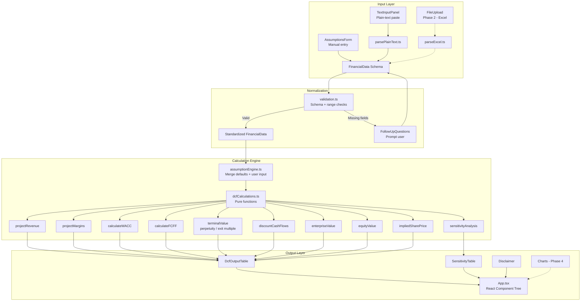
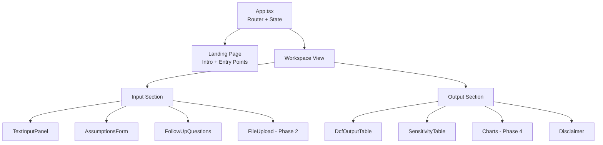

# Introduction

This Product Requirements Document defines the complete implementation plan for a greenfield, browser-based Discounted Cash Flow (DCF) model builder. The application accepts financial data via plain-text paste (Phase 1) or Excel upload (Phase 2), parses it into a standardized schema, detects missing fields, asks follow-up questions, and computes an industry-standard enterprise DCF valuation based on Free Cash Flow to the Firm (FCFF). The tool is deployed as a static site on GitHub Pages (frontend-only, no backend), built with React + TypeScript + Vite + Tailwind CSS. It is strictly educational/analytical — it surfaces all assumptions, sources, formulas, and uncertainty to the user and explicitly disclaims investment advice.

The key words "MUST", "MUST NOT", "REQUIRED", "SHALL", "SHALL NOT", "SHOULD", "SHOULD NOT", "RECOMMENDED", "MAY", and "OPTIONAL" in this document are to be interpreted as described in RFC 2119.

**Cross-reference conventions**: This document uses standardized prefixes for traceability — `FR-` (functional requirements from `.req.md`), `NFR-` (non-functional requirements from `.req.md`), `FM-` (failure modes from `.req.md`), `AC-` (acceptance criteria from `.req.md`), `REQ-` (plan-level requirements), `CON-` (constraints), `GUD-` (guidelines), `PAT-` (patterns), `SEC-` (security), and `RD-` (resolved decisions).

## 1. Goals and Non-Goals

- **Goal 1**: Deliver a fully functional, static-only DCF calculation engine with manual assumptions entry and text-paste input (Phase 1 MVP)
- **Goal 2**: Provide an educational experience where every formula, assumption, and intermediate value is transparent and explorable
- **Goal 3**: Enable beginner-friendly, copy-paste-granular implementation steps so the developer learns React, TypeScript, Vite, GitHub, and VS Code simultaneously
- **Goal 4**: Deploy to GitHub Pages with zero infrastructure cost and zero backend dependencies
- **Goal 5**: Architect the pure-function calculation engine for exhaustive unit testing (≥95% coverage)

- **Non-Goal 1**: Providing investment advice or buy/sell recommendations
- **Non-Goal 2**: Building a backend server, database, or authenticated user system
- **Non-Goal 3**: Supporting real-time market data or API-key-dependent research in MVP
- **Non-Goal 4**: Supporting specialized financial models (banking, insurance, real-estate FCFE)
- **Non-Goal 5**: Mobile-native applications (responsive web only)

### In Scope

- Static SPA on GitHub Pages (React + TypeScript + Vite + Tailwind CSS)
- Manual assumptions form with inline validation and tooltips
- Plain-text paste with parsing to standardized financial schema
- Complete FCFF DCF engine: NOPAT, FCFF, WACC (CAPM), TV (perpetuity + exit multiple), EV, Equity Value, Implied Share Price
- Configurable projection period (1–10 years, default 5)
- Conservative / Base / Optimistic scenarios
- DCF output table with year-by-year projections and summary metrics
- Sensitivity analysis table (WACC × growth rate matrix)
- Validation warnings for unrealistic inputs
- Educational disclaimer on all results views
- Formula transparency (expandable "Show Formula" per metric)
- Missing-field detection with follow-up question panel
- Vitest unit tests for all pure calculation functions
- GitHub Actions workflow for GitHub Pages deployment

### Out of Scope (deferred)

- Excel/CSV upload via SheetJS — deferred to Phase 2 (post-MVP)
- Internet research / financial data APIs — deferred to Phase 3 (requires API keys / server proxy)
- Recharts visualizations (waterfall, heatmap) — deferred to Phase 4
- Comparable company analysis — deferred to Phase 4
- CSV/spreadsheet export — deferred to Phase 4
- Advanced probability-weighted scenarios — deferred to Phase 4
- Multi-currency support — deferred indefinitely
- User authentication / data persistence beyond localStorage — deferred indefinitely
- PDF report generation — deferred indefinitely
- i18n / multi-language — deferred indefinitely

## 2. Terminology

Refer to the comprehensive terminology table in `dcf-model-builder.req.md` Section 1. Additional PRD-specific terms:

| Term | Definition |
|------|------------|
| Pure Function | A function with no side effects whose output depends solely on its inputs — deterministic and easily testable. |
| Greenfield | A project built from scratch with no pre-existing application code. |
| SPA | Single-Page Application — a web app that loads a single HTML page and dynamically updates content without full-page reloads. |
| Vite | A modern frontend build tool offering fast HMR (Hot Module Replacement) and optimized production builds via Rollup. |
| Vitest | A Vite-native unit testing framework compatible with Jest APIs. |
| HMR | Hot Module Replacement — a development feature that updates changed modules in the browser without a full page reload. |
| Tailwind CSS | A utility-first CSS framework that provides low-level utility classes for building custom designs. |
| GitHub Actions | GitHub's CI/CD platform used here to build and deploy the static site to GitHub Pages. |

## 3. Solution Architecture

### High-Level Data Flow

### Component Architecture

### Pure-Function Calculation Engine

The calculation engine (`src/utils/dcfCalculations.ts`) is the core of the application. It consists exclusively of pure functions with zero side effects, enabling:

1. **Deterministic testing**: Given identical inputs, outputs are always identical
2. **Composability**: Functions chain together — `projectRevenue → calculateFCFF → discountCashFlows → enterpriseValue`
3. **Isolation from UI**: The engine has no React dependencies; it operates on plain TypeScript types defined in `src/models/financialTypes.ts`

Key functions:
- `projectRevenue(baseRevenue, growthRates, years)` → annual revenue array
- `projectMargins(revenue[], marginRate, dAndARate, capExRate, nwcRate)` → operating metrics per year
- `calculateNOPAT(operatingIncome, taxRate)` → NOPAT value
- `calculateFCFF(nopat, dAndA, capEx, deltaNWC)` → FCFF value
- `calculateWACC(riskFreeRate, beta, erp, costOfDebt, debtToEquity, taxRate)` → WACC decimal
- `terminalValuePerpetual(finalFCFF, growthRate, wacc)` → TV via perpetuity growth
- `terminalValueExitMultiple(finalEBITDA, multiple)` → TV via exit multiple
- `discountCashFlows(cashFlows[], wacc)` → present value array
- `enterpriseValue(pvCashFlows[], pvTerminalValue)` → EV
- `equityValue(ev, netDebt)` → equity value
- `impliedSharePrice(equityValue, dilutedShares)` → per-share value
- `sensitivityAnalysis(baseInputs, waccRange, growthRange)` → 2D matrix of implied prices

### Static-Only Data Flow

All data flows are client-side:
1. User inputs (form or paste) → React state
2. React state → pure calculation functions → computed results
3. Computed results → React render → tables/UI
4. No network calls, no backend, no API dependencies in MVP
5. Optional localStorage for persisting last-used assumptions (graceful degradation per FM-009)

## 4. Requirements

**Summary**: The plan is constrained to a static frontend deployment on GitHub Pages using React + TypeScript + Vite. All computation is client-side. The calculation engine must be pure-function architecture with exhaustive unit testing. The UI must be educational, transparent, and accessible.

**Items**:
- **REQ-001**: All DCF calculations MUST be implemented as pure functions in `src/utils/dcfCalculations.ts` with zero side effects (traces to FR-003, NFR-005)
- **REQ-002**: The application MUST deploy as a static bundle to GitHub Pages via GitHub Actions (traces to NFR-001)
- **REQ-003**: Every displayed computed value MUST have an associated formula accessible within 1 interaction (traces to NFR-006, FR-014)
- **REQ-004**: The standardized `FinancialData` type MUST be the single source of truth for all input normalization (traces to FR-005)
- **REQ-005**: All form inputs MUST have real-time inline validation with educational error messages (traces to FR-002, FR-010)
- **CON-001**: GitHub Pages static hosting — no server-side code, no API keys stored, no database (traces to NFR-001, ASM-002)
- **CON-002**: TypeScript strict mode enabled; no `any` types in calculation modules (traces to NFR-009)
- **CON-003**: Production bundle < 200KB gzipped for Phase 1 (no SheetJS/Recharts) (traces to NFR-008)
- **CON-004**: Full DCF recalculation < 100ms on modern hardware (traces to NFR-002)
- **GUD-001**: Follow Tailwind CSS utility-first patterns; no custom CSS unless Tailwind utilities are insufficient (traces to NFR-010)
- **GUD-002**: React components SHOULD be functional components with hooks; class components MUST NOT be used
- **GUD-003**: Each component SHOULD have a single responsibility; logic and presentation SHOULD be separated
- **PAT-001**: Input → Normalize → Validate → Calculate → Render pipeline pattern for all data flows
- **PAT-002**: Calculation functions accept typed inputs and return typed outputs; no implicit globals or shared mutable state
- **SEC-001**: Uploaded/pasted files MUST be processed entirely in-browser; no data leaves the client (traces to NFR-001)
- **SEC-002**: No secrets, API keys, or credentials stored in the repository or client bundle for MVP

## 5. Risk Classification

**Risk**: 🟢 LOW

**Summary**: This is a static frontend application with no backend, no authentication, no PII storage, no financial transactions, and no external API dependencies in MVP. The primary risks are computational correctness (mitigated by exhaustive unit tests) and scope creep (mitigated by strict phase boundaries). The deployment target (GitHub Pages) is a mature, stable platform with zero operational risk.

**Items**:
- **RISK-001**: Calculation errors in DCF engine could produce misleading educational outputs — mitigated by ≥95% unit test coverage with known-answer test vectors from financial textbooks (NFR-005)
- **RISK-002**: Scope creep from Phase 2–4 features bleeding into Phase 1 — mitigated by strict phase boundaries, deferred imports, and no SheetJS/Recharts dependencies in Phase 1 bundle
- **RISK-003**: Beginner developer may struggle with TypeScript strict mode — mitigated by granular implementation steps with explicit file contents and copy-paste instructions
- **RISK-004**: Plain-text parser may not handle all financial data formats — mitigated by clear error messaging (FM-002) and manual-entry fallback (FR-002)
- **ASSUMPTION-001**: GitHub Pages continues to support SPA routing via 404.html fallback or hash routing (high confidence — established pattern)
- **ASSUMPTION-002**: Vitest remains compatible with Vite 5+ and React 18+ (high confidence — same ecosystem)
- **ASSUMPTION-003**: The developer has Node.js 18+ and npm/pnpm installed locally (standard prerequisite)

## 6. Dependencies

**Summary**: All dependencies are stable, well-maintained npm packages with no server-side requirements. Phase 1 has minimal dependencies to keep bundle size small.

**Items**:
- **DEP-001**: `react` + `react-dom` ^18.x — UI framework (stable, LTS)
- **DEP-002**: `typescript` ^5.x — type system (stable)
- **DEP-003**: `vite` ^5.x — build tool and dev server (stable)
- **DEP-004**: `tailwindcss` ^3.x + `postcss` + `autoprefixer` — styling (stable)
- **DEP-005**: `vitest` ^1.x — unit testing framework (stable, Vite-native)
- **DEP-006**: `@testing-library/react` — component testing utilities (Phase 1 optional, Phase 2+)
- **DEP-007**: `xlsx` (SheetJS) — client-side Excel parsing (Phase 2 only, not installed in Phase 1)
- **DEP-008**: `recharts` — React charting library (Phase 4 only, not installed in Phase 1)
- **DEP-009**: Node.js ^18.x + npm — local development runtime (prerequisite)
- **DEP-010**: GitHub Actions — CI/CD for deployment (free tier sufficient)

## 7. Quality & Testing

**Summary**: The testing strategy centers on exhaustive Vitest unit tests for the pure-function calculation engine, supplemented by manual testing of UI flows. Phase 1 prioritizes calculation correctness; E2E testing (Playwright) is deferred to Phase 2+ when the UI stabilizes.

**Items**:
- **TEST-001**: Unit test `calculateNOPAT` — verify NOPAT = Operating Income × (1 − Tax Rate) with 3+ test vectors including edge cases (zero tax, 100% tax, negative operating income)
- **TEST-002**: Unit test `calculateFCFF` — verify FCFF = NOPAT + D&A − CapEx − ΔNWC with positive, negative, and zero component combinations
- **TEST-003**: Unit test `calculateWACC` — verify WACC formula with standard inputs, all-equity (D/V=0), and all-debt (E/V=0) edge cases
- **TEST-004**: Unit test `terminalValuePerpetual` — verify TV = FCFF_n × (1+g) / (WACC−g); test edge case WACC ≤ g throws/returns error
- **TEST-005**: Unit test `terminalValueExitMultiple` — verify TV = EBITDA_n × Multiple; test zero/negative multiple edge cases
- **TEST-006**: Unit test `discountCashFlows` — verify PV = CF_t / (1+WACC)^t for multi-year arrays
- **TEST-007**: Unit test `enterpriseValue` — verify EV = sum of PV(FCFFs) + PV(TV)
- **TEST-008**: Unit test `equityValue` — verify Equity = EV − Net Debt; test negative net debt (net cash)
- **TEST-009**: Unit test `impliedSharePrice` — verify Price = Equity Value / Diluted Shares; test zero shares edge case
- **TEST-010**: Unit test `sensitivityAnalysis` — verify matrix dimensions match input ranges; verify base-case cell matches standalone calculation
- **TEST-011**: Unit test `projectRevenue` — verify compound growth over N years with constant and variable rates
- **TEST-012**: Unit test `projectMargins` — verify NOPAT, D&A, CapEx, ΔNWC projections as % of revenue
- **TEST-013**: Unit test `validation.ts` — verify each warning rule (WACC ≤ g, growth > 30%, margin > 50%, missing CapEx, TV > 85% EV, banking/insurance industry)
- **TEST-014**: Unit test `parsePlainText.ts` — verify extraction of numeric values from various text formats; verify error on unparseable lines
- **TEST-015**: Integration test — full pipeline: sample inputs → all calculations → verify final implied share price matches hand-calculated value (known-answer test from CFA textbook example)

### Acceptance Criteria

| ID | Criterion | Verification | Traces To |
|----|-----------|--------------|-----------|
| AC-001 | User can paste multi-line financial text and see it parsed into the standardized schema | Manual test + automated parsing unit tests | FR-001, FR-005 |
| AC-002 | User can manually enter all DCF assumptions via form inputs with inline validation | Manual test | FR-002 |
| AC-003 | Engine computes NOPAT, FCFF, WACC, PV, TV, EV, Equity Value, Implied Share Price correctly (3+ hand-calculated cases) | Vitest unit tests (TEST-001 through TEST-012) | FR-003, NFR-005 |
| AC-004 | User can toggle between perpetuity growth and exit multiple TV methods with immediate recalculation | Manual test | FR-004 |
| AC-005 | Schema validation rejects incomplete data with field-level error messages | Unit tests on validation.ts | FR-005 |
| AC-006 | Projection table shows year-by-year financials for configurable period (default 5, range 1–10) | Manual test + unit tests | FR-006 |
| AC-007 | Three scenarios (Conservative/Base/Optimistic) switch and update all outputs | Manual test | FR-007 |
| AC-008 | Output table displays all required columns plus summary valuation metrics | Manual visual inspection | FR-008 |
| AC-009 | Sensitivity table renders WACC × Growth Rate matrix with base-case highlighted | Manual test | FR-009 |
| AC-010 | WACC ≤ growth rate displays prominent error; perpetuity TV not calculated | Unit test (TEST-004) + manual test | FR-010, FM-004 |
| AC-011 | Validation warnings fire for all specified conditions | Unit tests (TEST-013) | FR-010 |
| AC-012 | Landing page shows tool description, disclaimer, and two entry-point buttons | Manual visual test | FR-011 |
| AC-013 | Assumptions editor groups inputs by category with tooltips and reset-to-defaults | Manual test | FR-012 |
| AC-014 | Disclaimer visible on all results views, cannot be permanently dismissed | Manual test | FR-013, NFR-007 |
| AC-015 | Each computed value has expandable "Show Formula" with actual numbers substituted | Manual test | FR-014, NFR-006 |
| AC-016 | Missing fields after paste trigger follow-up panel listing what's needed | Manual test | FR-015 |
| AC-017 | Application deploys to GitHub Pages; all features work without backend | Deploy + manual smoke test | NFR-001 |
| AC-018 | Full DCF recalculation < 100ms; page load < 3s on 4G | Lighthouse + Performance API | NFR-002 |
| AC-019 | TypeScript strict mode enabled; no `any` in calc modules; ESLint passes | `tsc --noEmit` + ESLint in CI | NFR-009 |
| AC-020 | Calculation engine ≥ 95% unit test coverage | Vitest coverage report | NFR-005 |

## 8. Security Considerations

- **Data handling**: All financial data entered or pasted by the user is processed entirely in-browser. No data is transmitted to any server. File uploads (Phase 2) are parsed client-side via SheetJS; the File object never leaves the browser sandbox. localStorage is used only for optional preference persistence (non-sensitive).
- **Input validation**: All numeric inputs are validated client-side with type coercion guards. The text parser sanitizes input to extract only numeric patterns. No `eval()` or dynamic code execution is used. HTML content in paste inputs is stripped to prevent XSS via `textContent` extraction.
- **Access control**: Not applicable — no authentication, no user accounts, no server-side resources. The application is a static site accessible to anyone with the URL.
- **Secrets**: No secrets, API keys, or credentials exist in the MVP. The GitHub Actions deploy workflow uses only the built-in `GITHUB_TOKEN` (automatically provided, not user-managed). Phase 3 (future) will require careful handling of user-provided API keys — this is explicitly deferred and will require a separate security review.
- **Supply chain**: Dependencies are pinned via lockfile. `npm audit` SHOULD be run in CI to detect known vulnerabilities in transitive dependencies.

## 9. Deployment & Rollback

**Deployment Strategy**:
1. GitHub Actions workflow (`.github/workflows/deploy.yml`) triggers on push to `main` branch
2. Workflow runs: install dependencies → build (`vite build` with `base: '/DCF-Project/'`) → deploy to `gh-pages` branch
3. GitHub Pages serves the `gh-pages` branch content at `https://<username>.github.io/DCF-Project/`

**Rollback**:
- Revert the `main` branch commit and push — the workflow will redeploy the previous version
- Alternatively, force-push the `gh-pages` branch to a previous commit for immediate rollback without rebuilding
- Since this is a static site with no database or state, rollback has zero data implications

**Monitoring**:
- GitHub Actions build status badge in README
- Manual smoke test after each deployment (open the URL, verify calculation works)
- Lighthouse CI score check (optional, post-MVP)

## 10. Resolved Decisions

| ID | Decision | Rationale |
|----|----------|-----------|
| RD-001 | Use FCFF (Free Cash Flow to Firm) discounted at WACC, not FCFE | FCFF is the most widely taught, general-purpose DCF approach. Does not require modeling debt schedules. Standard in CFA curriculum and analyst training. (traces to ALT-001) |
| RD-002 | Use Vite as build tool (not Create React App or Next.js) | Vite offers fastest HMR, native TypeScript support, and produces optimized static builds. CRA is deprecated/unmaintained. Next.js adds unnecessary server-side complexity for a static app. (traces to CON-001) |
| RD-003 | Use Recharts for future charts (not Chart.js or D3) | Recharts is React-native (component-based API), has good TypeScript support, and handles responsive behavior well. Deferred to Phase 4 to keep Phase 1 bundle small. |
| RD-004 | Frontend-only architecture (no backend) | GitHub Pages is static-only hosting. All computation is feasible client-side. Eliminates infrastructure cost, deployment complexity, and security surface. (traces to CON-001, NFR-001) |
| RD-005 | Perpetuity growth as default TV method (exit multiple as toggle option) | Perpetuity growth is more theoretically self-contained (no need for comparable multiples). Standard pedagogical default. Exit multiple available for users who prefer it. (traces to ALT-002, FR-004) |
| RD-006 | Use Vitest (not Jest) for unit testing | Vitest is Vite-native, shares the same config and transform pipeline, and has Jest-compatible API. Zero additional configuration needed. Faster execution than Jest for Vite projects. |
| RD-007 | Tables only in Phase 1; charts deferred to Phase 4 | Tables are sufficient for Phase 1 MVP. Charts add scope (responsive behavior, accessibility, component design) better addressed when core is stable. Keeps bundle < 200KB. (traces to ALT-006, NFR-008) |
| RD-008 | Independent scenario assumption sets (not fixed percentage deltas) | Independent sets give maximum flexibility for educational exploration. Users can model any combination of assumptions per scenario. (traces to ALT-007, FR-007) |
| RD-009 | Fixed WACC × Growth Rate sensitivity matrix for MVP (user-selectable axes deferred) | These two variables have highest impact on DCF output. Fixed matrix reduces UI complexity. User-selectable axes are Phase 4. (traces to ALT-005, FR-009) |

## 11. Alternatives Considered

| Alternative | Pros | Cons | Decision |
|-------------|------|------|----------|
| Create React App (CRA) | Familiar to many tutorials | Deprecated, slow builds, no native TS HMR, larger bundle | Rejected — Vite is superior in every metric (RD-002) |
| Next.js | SSR/SSG capabilities, large ecosystem | Adds server-side complexity unnecessary for static app; deployment to GitHub Pages requires extra config; overkill for single-page calculator | Rejected — unnecessary complexity for static SPA (RD-002) |
| Chart.js (canvas-based) | Lightweight, widely used | Not React-native (requires wrapper), imperative API, poor TypeScript DX | Rejected — Recharts offers better React integration (RD-003) |
| D3.js | Maximum flexibility, industry standard | Steep learning curve, imperative, requires significant boilerplate for basic charts | Rejected — too complex for educational project (RD-003) |
| FCFE model | Directly values equity | Requires debt schedule modeling, less general, less commonly taught | Rejected — FCFF is more general-purpose and pedagogically standard (RD-001) |
| Backend + database architecture | Enables data persistence, API integration, multi-user | Requires hosting infrastructure, increases cost/complexity, violates GitHub Pages constraint | Rejected — violates core constraint CON-001 (RD-004) |
| Jest for testing | Most popular JS test framework | Requires separate configuration for Vite projects, slower transforms, more boilerplate | Rejected — Vitest is Vite-native with zero-config (RD-006) |
| Exit Multiple as default TV method | Simpler calculation, market-observable | Requires comparable company data not available in MVP; less pedagogically self-contained | Rejected as default — available as toggle option (RD-005) |

## 12. Files

**Phase 1 MVP files (all new — greenfield project)**:

- **FILE-001**: `package.json` — Project manifest with dependencies (react, react-dom, typescript, vite, tailwindcss, vitest) and scripts (dev, build, test, preview)
- **FILE-002**: `vite.config.ts` — Vite configuration with React plugin and `base` path for GitHub Pages
- **FILE-003**: `tailwind.config.js` — Tailwind CSS configuration with content paths
- **FILE-004**: `postcss.config.js` — PostCSS configuration loading Tailwind and autoprefixer
- **FILE-005**: `tsconfig.json` — TypeScript strict-mode configuration
- **FILE-006**: `index.html` — Vite entry HTML with root div mount point
- **FILE-007**: `src/main.tsx` — React app entry point (renders App into root)
- **FILE-008**: `src/App.tsx` — Root component with routing/state management and component tree
- **FILE-009**: `src/models/financialTypes.ts` — TypeScript interfaces/types for FinancialData schema, DCF inputs, outputs, validation results
- **FILE-010**: `src/data/defaultAssumptions.ts` — Educational default values for all assumptions (risk-free rate, ERP, beta, margins, etc.)
- **FILE-011**: `src/utils/dcfCalculations.ts` — Pure-function DCF engine (all calculation functions)
- **FILE-012**: `src/utils/validation.ts` — Input validation and warning rules
- **FILE-013**: `src/utils/parsePlainText.ts` — Plain-text financial data parser
- **FILE-014**: `src/utils/assumptionEngine.ts` — Merges user inputs with defaults, manages scenario switching
- **FILE-015**: `src/components/Disclaimer.tsx` — Educational disclaimer component
- **FILE-016**: `src/components/TextInputPanel.tsx` — Multi-line text paste area with parse trigger
- **FILE-017**: `src/components/AssumptionsForm.tsx` — Grouped form for all DCF assumptions with validation
- **FILE-018**: `src/components/FollowUpQuestions.tsx` — Missing-field detection and prompt panel
- **FILE-019**: `src/components/DcfOutputTable.tsx` — Year-by-year DCF results table + summary metrics
- **FILE-020**: `src/components/SensitivityTable.tsx` — WACC × Growth Rate sensitivity matrix
- **FILE-021**: `src/components/Charts.tsx` — Placeholder/stub for Phase 4 charts integration
- **FILE-022**: `tests/dcfCalculations.test.ts` — Comprehensive unit tests for all calculation functions
- **FILE-023**: `tests/validation.test.ts` — Unit tests for all validation warning rules
- **FILE-024**: `tests/parsePlainText.test.ts` — Unit tests for text parser
- **FILE-025**: `.github/workflows/deploy.yml` — GitHub Actions workflow for GitHub Pages deployment
- **FILE-026**: `README.md` — Project documentation (setup, usage, architecture overview)
- **FILE-027**: `src/index.css` — Tailwind CSS directives (@tailwind base/components/utilities)

**Phase 2 additions (deferred)**:
- **FILE-028**: `src/utils/parseExcel.ts` — SheetJS-based Excel/CSV parser
- **FILE-029**: `src/components/FileUpload.tsx` — Drag-and-drop file upload component

**Phase 4 additions (deferred)**:
- **FILE-030**: `src/components/Charts.tsx` — Full Recharts implementation (waterfall, heatmap)

## 13. Simplicity Rationale

- **Scope justification**: Every EPIC below traces directly to functional requirements from the `.req.md`. EPIC-001 (scaffolding) enables REQ-002/CON-001. EPIC-002 (types/defaults) enables REQ-004/FR-005. EPIC-003 (calculation engine) enables FR-003/REQ-001. EPIC-004 (validation) enables FR-010. EPIC-005 (UI shell) enables FR-011/FR-013. EPIC-006 (assumptions form + text input) enables FR-001/FR-002. EPIC-007 (output tables) enables FR-008/FR-009. EPIC-008 (follow-up questions) enables FR-015. EPIC-009 (deployment) enables NFR-001/REQ-002. No EPIC exists for purely structural or enabling reasons without a direct requirement trace.
- **Abstractions check**: The only abstraction is the `FinancialData` interface and related types in `financialTypes.ts`. This is not over-engineering — it is the standardized schema explicitly required by FR-005. No factories, strategy patterns, or base classes are introduced.
- **Configuration check**: No feature flags or extension points. The only configuration is `defaultAssumptions.ts` (required by FR-002's placeholder values) and `vite.config.ts` `base` path (required for GitHub Pages routing).
- **Could this be simpler?**: The simplest approach would be a single HTML file with inline JavaScript performing DCF calculations. This was rejected because: (1) it cannot satisfy NFR-009 (TypeScript strict mode), (2) it cannot satisfy NFR-005 (unit test coverage via Vitest), (3) it cannot scale to the phased feature additions, and (4) the developer is explicitly learning React/TypeScript tooling. The chosen approach (Vite + React + TypeScript) is the minimal viable toolchain that satisfies all stated requirements and learning goals.

## 14. Implementation Plan

### EPIC-001: Project Scaffolding and Dev Environment Setup (DONE)

**Goal**: Initialize the Vite + React + TypeScript project, install dependencies, configure Tailwind CSS, establish folder structure, and verify the dev server runs. This is the foundation that all subsequent EPICs depend on.

**Traces to**: REQ-002, CON-001, CON-002, NFR-001, NFR-009, ASM-008

| Task | Description | Status | Relevant Files |
|------|-------------|--------|----------------|
| ITEM-001 | Create the project using `npm create vite@latest . -- --template react-ts`. This generates `package.json`, `tsconfig.json`, `vite.config.ts`, `index.html`, `src/main.tsx`, and `src/App.tsx` with React + TypeScript defaults. Run this command in the project root directory. Verify by running `npm run dev` and confirming the Vite welcome page loads at `http://localhost:5173`. | Done | package.json, vite.config.ts, tsconfig.json, index.html, src/main.tsx, src/App.tsx |
| ITEM-002 | Install Tailwind CSS and its peer dependencies: run `npm install -D tailwindcss postcss autoprefixer` then `npx tailwindcss init -p`. This creates `tailwind.config.js` and `postcss.config.js`. Verify both files exist in the project root. | Done | tailwind.config.js, postcss.config.js |
| ITEM-003 | Configure Tailwind content paths: open `tailwind.config.js` and set `content: ['./index.html', './src/**/*.{js,ts,jsx,tsx}']`. This tells Tailwind which files to scan for utility classes. | Done | tailwind.config.js |
| ITEM-004 | Create `src/index.css` with Tailwind directives. The file MUST contain exactly three lines: `@tailwind base;`, `@tailwind components;`, `@tailwind utilities;`. Then import this file in `src/main.tsx` by adding `import './index.css'` at the top. | Done | src/index.css, src/main.tsx |
| ITEM-005 | Update `tsconfig.json` to enable strict mode. Ensure `"strict": true`, `"noUnusedLocals": true`, `"noUnusedParameters": true`, and `"noFallthroughCasesInSwitch": true` are all set under `compilerOptions`. | Done | tsconfig.json |
| ITEM-006 | Create the project folder structure. Create these empty directories: `src/components/`, `src/models/`, `src/utils/`, `src/data/`, `tests/`. This establishes the organizational structure for all subsequent code. | Done | src/components/, src/models/, src/utils/, src/data/, tests/ |
| ITEM-007 | Update `vite.config.ts` to set `base: '/DCF-Project/'` (or the correct repository name) for GitHub Pages deployment. This ensures all asset paths are correct when served from a subpath. | Done | vite.config.ts |
| ITEM-008 | Install Vitest for unit testing: run `npm install -D vitest`. Add a `"test"` script to `package.json`: `"test": "vitest"` and a `"test:coverage"` script: `"test:coverage": "vitest run --coverage"`. Verify with `npm test -- --run` (should exit cleanly with no tests found). | Done | package.json |
| ITEM-009 | Verify the full setup: run `npm run dev` (dev server starts), run `npm run build` (produces `dist/` folder with static assets), run `npm test -- --run` (exits cleanly). Delete the Vite default boilerplate content from `src/App.tsx` (replace with a simple `<h1>DCF Model Builder</h1>` placeholder). Confirm the page renders in the browser. | Done | src/App.tsx |

---

### EPIC-002: Define Financial Types and Default Assumptions (DONE)

**Goal**: Establish the TypeScript type system that defines the standardized financial data schema and the educational default assumption values. These types are the contract between all input methods, the calculation engine, and the output components.

**Traces to**: FR-005, REQ-004, FR-002 (placeholder values), ASM-004, ASM-005

| Task | Description | Status | Relevant Files |
|------|-------------|--------|----------------|
| ITEM-010 | Create `src/models/financialTypes.ts` with the `FinancialData` interface containing all required fields: `revenue: number`, `operatingIncome: number`, `taxRate: number`, `depreciationAmortization: number`, `capitalExpenditures: number`, `changeInNWC: number`, `netDebt: number`, `sharesOutstanding: number`. Add a `WACCInputs` interface: `riskFreeRate: number`, `beta: number`, `equityRiskPremium: number`, `costOfDebt: number`, `debtToEquityRatio: number`. Add a `TerminalValueInputs` interface: `perpetuityGrowthRate: number`, `exitMultiple: number`, `finalYearEBITDA: number`, `method: 'perpetuity' \| 'exitMultiple'`. Add a `ProjectionInputs` interface: `revenueGrowthRate: number`, `operatingMarginRate: number`, `dAndARate: number`, `capExRate: number`, `nwcRate: number`, `projectionYears: number`. Add a `CompanyInfo` interface: `companyName: string`, `tickerSymbol?: string`, `industry?: string`, `currency: string`. Add a `DCFInputs` interface that combines all of the above. Add a `DCFOutputs` interface: `projectedRevenue: number[]`, `projectedFCFF: number[]`, `discountFactors: number[]`, `pvFCFF: number[]`, `terminalValue: number`, `pvTerminalValue: number`, `enterpriseValue: number`, `equityValue: number`, `impliedSharePrice: number`, `wacc: number`. Add a `ValidationWarning` interface: `field: string`, `message: string`, `severity: 'error' \| 'warning'`. Export all interfaces. | Done | src/models/financialTypes.ts |
| ITEM-011 | Create `src/data/defaultAssumptions.ts` that exports a `DEFAULT_ASSUMPTIONS` constant of type `DCFInputs` (import from financialTypes). Populate with educational defaults: `riskFreeRate: 0.04` (4% — approximate 10Y US Treasury), `beta: 1.0` (market average), `equityRiskPremium: 0.055` (5.5% — historical average), `costOfDebt: 0.05` (5%), `debtToEquityRatio: 0.5`, `taxRate: 0.21` (US corporate rate), `perpetuityGrowthRate: 0.025` (2.5% — near GDP growth), `exitMultiple: 10` (EV/EBITDA), `revenueGrowthRate: 0.05` (5%), `operatingMarginRate: 0.15` (15%), `dAndARate: 0.03`, `capExRate: 0.04`, `nwcRate: 0.01`, `projectionYears: 5`. Include comments explaining why each default was chosen. | Done | src/data/defaultAssumptions.ts |

---

### EPIC-003: Build the Pure DCF Calculation Engine with Vitest Tests (DONE)

**Goal**: Implement all DCF calculation logic as pure functions and verify correctness with exhaustive unit tests using known-answer test vectors. This is the mathematical core of the application.

**Traces to**: FR-003, FR-004, FR-006, FR-009, REQ-001, NFR-005, AC-003, AC-006, AC-009, AC-010

| Task | Description | Status | Relevant Files |
|------|-------------|--------|----------------|
| ITEM-012 | Create `src/utils/dcfCalculations.ts` with the `calculateNOPAT` function: accepts `operatingIncome: number` and `taxRate: number`, returns `operatingIncome * (1 - taxRate)`. Export the function. Verify: `calculateNOPAT(1000000, 0.21)` should return `790000`. | Done | src/utils/dcfCalculations.ts |
| ITEM-013 | Add `calculateFCFF` function to `dcfCalculations.ts`: accepts `nopat: number`, `dAndA: number`, `capEx: number`, `deltaNWC: number`, returns `nopat + dAndA - capEx - deltaNWC`. Verify: `calculateFCFF(790000, 50000, 80000, 10000)` returns `750000`. | Done | src/utils/dcfCalculations.ts |
| ITEM-014 | Add `calculateWACC` function: accepts `riskFreeRate`, `beta`, `erp`, `costOfDebt`, `debtToEquityRatio`, `taxRate` (all numbers). Compute: `costOfEquity = riskFreeRate + beta * erp`, `equityWeight = 1 / (1 + debtToEquityRatio)`, `debtWeight = debtToEquityRatio / (1 + debtToEquityRatio)`, return `equityWeight * costOfEquity + debtWeight * costOfDebt * (1 - taxRate)`. Verify with sample: Rf=0.04, β=1.2, ERP=0.055, Rd=0.05, D/E=0.5, T=0.21 → Re=0.106, E/V=0.667, D/V=0.333, WACC≈0.0839. | Done | src/utils/dcfCalculations.ts |
| ITEM-015 | Add `projectRevenue` function: accepts `baseRevenue: number` and `growthRate: number` and `years: number`, returns `number[]` of length `years` where each element is `baseRevenue * (1 + growthRate)^t` for t=1..years. Verify: base=1000, growth=0.10, years=3 → [1100, 1210, 1331]. | Done | src/utils/dcfCalculations.ts |
| ITEM-016 | Add `projectMargins` function: accepts `projectedRevenue: number[]`, `operatingMarginRate`, `dAndARate`, `capExRate`, `nwcRate`, `taxRate` (all numbers). For each year, compute: `operatingIncome = revenue * operatingMarginRate`, `nopat = operatingIncome * (1 - taxRate)`, `dAndA = revenue * dAndARate`, `capEx = revenue * capExRate`, `deltaNWC = (revenue - prevRevenue) * nwcRate` (prevRevenue is previous year's revenue or base revenue for year 1), `fcff = nopat + dAndA - capEx - deltaNWC`. Return an object with arrays: `{ operatingIncome[], nopat[], dAndA[], capEx[], deltaNWC[], fcff[] }`. | Done | src/utils/dcfCalculations.ts |
| ITEM-017 | Add `terminalValuePerpetual` function: accepts `finalFCFF: number`, `growthRate: number`, `wacc: number`. If `wacc <= growthRate`, throw an Error with message "WACC must be greater than perpetuity growth rate". Otherwise return `finalFCFF * (1 + growthRate) / (wacc - growthRate)`. Verify: FCFF=750000, g=0.025, WACC=0.09 → TV = 750000*1.025/0.065 ≈ 11,826,923. | Done | src/utils/dcfCalculations.ts |
| ITEM-018 | Add `terminalValueExitMultiple` function: accepts `finalEBITDA: number` and `multiple: number`. If `multiple <= 0`, throw an Error. Return `finalEBITDA * multiple`. Verify: EBITDA=500000, multiple=10 → TV=5,000,000. | Done | src/utils/dcfCalculations.ts |
| ITEM-019 | Add `discountCashFlows` function: accepts `cashFlows: number[]` and `wacc: number`. Returns `number[]` where each element is `cashFlows[i] / (1 + wacc)^(i+1)`. Verify: [100, 100, 100] at wacc=0.10 → [90.91, 82.64, 75.13] (approximately). | Done | src/utils/dcfCalculations.ts |
| ITEM-020 | Add `enterpriseValue` function: accepts `pvCashFlows: number[]` and `pvTerminalValue: number`. Returns sum of all pvCashFlows plus pvTerminalValue. | Done | src/utils/dcfCalculations.ts |
| ITEM-021 | Add `equityValue` function: accepts `enterpriseValue: number` and `netDebt: number`. Returns `enterpriseValue - netDebt`. Handles negative netDebt (net cash position). | Done | src/utils/dcfCalculations.ts |
| ITEM-022 | Add `impliedSharePrice` function: accepts `equityValue: number` and `dilutedShares: number`. If `dilutedShares <= 0`, throw an Error. Returns `equityValue / dilutedShares`. | Done | src/utils/dcfCalculations.ts |
| ITEM-023 | Add `sensitivityAnalysis` function: accepts base DCF inputs, `waccRange: number[]` (array of WACC values to test), `growthRange: number[]` (array of growth rates to test). Returns a 2D array `number[][]` where `result[i][j]` is the implied share price computed using `waccRange[i]` and `growthRange[j]` with all other inputs held constant. Uses the perpetuity method for TV in each cell (skips cells where wacc ≤ growth, filling with `null` or `NaN`). | Done | src/utils/dcfCalculations.ts |
| ITEM-024 | Add a top-level `runFullDCF` orchestrator function: accepts `DCFInputs` (from financialTypes), calls projectRevenue, projectMargins, calculateWACC, terminalValuePerpetual or terminalValueExitMultiple based on `method`, discountCashFlows, enterpriseValue, equityValue, impliedSharePrice. Returns a complete `DCFOutputs` object. This is the single entry point for the UI to invoke the full calculation pipeline. | Done | src/utils/dcfCalculations.ts |
| ITEM-025 | Create `tests/dcfCalculations.test.ts` with Vitest unit tests for every function: `calculateNOPAT` (3 cases including zero tax, 100% tax, negative income), `calculateFCFF` (3 cases including all-zero components), `calculateWACC` (3 cases including all-equity, standard, high-leverage), `projectRevenue` (constant growth, 0% growth, negative growth), `projectMargins` (standard case, zero margins), `terminalValuePerpetual` (standard, edge case wacc=g throws error), `terminalValueExitMultiple` (standard, zero multiple throws), `discountCashFlows` (multi-year, single year, 0% WACC), `enterpriseValue` (standard), `equityValue` (positive debt, negative debt/net cash), `impliedSharePrice` (standard, zero shares throws), `sensitivityAnalysis` (verify matrix dimensions, verify base-case cell), `runFullDCF` (full integration test with textbook-derived known answer). Minimum 30 test cases total. | Done | tests/dcfCalculations.test.ts |
| ITEM-026 | Run `npm test` and verify all tests pass. Run `npm run test:coverage` and verify ≥95% line coverage on `src/utils/dcfCalculations.ts`. Fix any failures. | Done | tests/dcfCalculations.test.ts, src/utils/dcfCalculations.ts |

---

### EPIC-004: Input Validation and Warning System

**Goal**: Implement the validation engine that detects unrealistic inputs and surfaces educational warnings without blocking calculation.

**Traces to**: FR-010, FM-004, FM-006, AC-010, AC-011

| Task | Description | Status | Relevant Files |
|------|-------------|--------|----------------|
| ITEM-027 | Create `src/utils/validation.ts` with a `validateInputs` function: accepts `DCFInputs`, returns `ValidationWarning[]`. Implement all warning rules: (1) WACC ≤ perpetuityGrowthRate → severity 'error', message explains perpetuity TV is mathematically invalid. (2) revenueGrowthRate > 0.30 or < -0.20 → severity 'warning', message explains extreme growth. (3) operatingMarginRate > 0.50 or < -0.10 → 'warning'. (4) capExRate === 0 when revenueGrowthRate > 0 → 'warning', likely missing data. (5) terminalValue > 0.85 * enterpriseValue → 'warning' (this check requires computed outputs, so add a separate `validateOutputs` function for post-calculation checks). (6) industry is 'banking', 'insurance', or 'real-estate' → 'warning', FCFF may be inappropriate. (7) Any required numeric field is NaN, undefined, or null → severity 'error'. | Not Started | src/utils/validation.ts |
| ITEM-028 | Create `tests/validation.test.ts` with unit tests for each warning rule. Test that valid inputs produce zero warnings. Test each rule individually by providing inputs that trigger exactly that rule. Test multiple simultaneous warnings. Test the 'error' vs 'warning' severity distinction. Minimum 15 test cases. | Not Started | tests/validation.test.ts |
| ITEM-029 | Run `npm test` and verify all validation tests pass alongside calculation tests. | Not Started | tests/validation.test.ts |

---

### EPIC-005: UI Shell, Landing Page, and Disclaimer Component

**Goal**: Build the application shell with routing between landing page and workspace view. Implement the Disclaimer component and landing page per FR-011 and FR-013.

**Traces to**: FR-011, FR-013, NFR-007, AC-012, AC-014

| Task | Description | Status | Relevant Files |
|------|-------------|--------|----------------|
| ITEM-030 | Create `src/components/Disclaimer.tsx`: a functional React component that renders a visually distinct bordered box (Tailwind: `border-2 border-yellow-500 bg-yellow-50 p-4 rounded`) with a warning icon (⚠️ emoji or SVG) and the text: "For educational and analytical purposes only. Not investment advice. Results are entirely dependent on user-provided assumptions and may not reflect actual company value." The component accepts a `minimizable?: boolean` prop — when true, a toggle button allows collapsing to a single line, but the disclaimer remains accessible (never fully dismissed). | Not Started | src/components/Disclaimer.tsx |
| ITEM-031 | Update `src/App.tsx` to implement a simple state-based "routing": a `view` state variable with values `'landing'` or `'workspace'`. When `view === 'landing'`, render the landing page content. When `view === 'workspace'`, render the workspace layout (placeholder for now). Use `useState('landing')` to start on the landing page. | Not Started | src/App.tsx |
| ITEM-032 | Implement the landing page content in `App.tsx` (or a separate `LandingPage` component): display the app title "DCF Model Builder", a brief 2–3 sentence description of DCF valuation, the Disclaimer component, and two buttons: "Enter Assumptions Manually" (sets view to 'workspace' with mode='manual') and "Paste Financial Data" (sets view to 'workspace' with mode='paste'). Style with Tailwind utilities for a clean, centered layout. | Not Started | src/App.tsx, src/components/Disclaimer.tsx |
| ITEM-033 | Run `npm run dev`, open the browser, and verify: landing page displays correctly with title, description, disclaimer, and two buttons. Clicking either button transitions to the workspace view (placeholder content is fine). | Not Started | src/App.tsx |

---

### EPIC-006: Assumptions Form, Text Input Panel, and Plain-Text Parser

**Goal**: Build the primary input UI components: the structured assumptions form (FR-002/FR-012) and the text paste panel with parsing logic (FR-001). Wire them to populate the DCFInputs state.

**Traces to**: FR-001, FR-002, FR-005, FR-012, FR-016, AC-001, AC-002, AC-013

| Task | Description | Status | Relevant Files |
|------|-------------|--------|----------------|
| ITEM-034 | Create `src/utils/parsePlainText.ts` with a `parsePlainText` function: accepts a `text: string`, returns `{ parsed: Partial<FinancialData>, errors: string[] }`. The parser splits text by newlines, uses regex to identify key-value patterns (e.g., "Revenue: 1,000,000" or "Revenue 1000000" or "revenue = 1M"). Maps recognized labels (case-insensitive, with common aliases like "Rev", "Sales", "Top Line" → revenue) to schema fields. Strips commas, handles K/M/B suffixes. Lines that cannot be parsed are added to the `errors` array with the original line text. | Not Started | src/utils/parsePlainText.ts |
| ITEM-035 | Create `tests/parsePlainText.test.ts` with unit tests: test successful parsing of standard formats ("Revenue: 1,000,000"), test alias recognition ("Sales: 500K"), test suffix handling (M=million, B=billion, K=thousand), test error collection for unrecognized lines, test empty input returns empty object, test multi-field extraction from multi-line paste. Minimum 10 test cases. | Not Started | tests/parsePlainText.test.ts |
| ITEM-036 | Create `src/utils/assumptionEngine.ts` with a `mergeAssumptions` function: accepts `userInputs: Partial<DCFInputs>` and returns complete `DCFInputs` by merging user values over `DEFAULT_ASSUMPTIONS`. Any field provided by the user overrides the default; missing fields fall back to defaults. Also export a `createScenario` function that takes base assumptions and a scenario type ('conservative' \| 'base' \| 'optimistic') and returns adjusted inputs (conservative: growth −2%, WACC +1%; optimistic: growth +2%, WACC −1%). | Not Started | src/utils/assumptionEngine.ts |
| ITEM-037 | Create `src/components/TextInputPanel.tsx`: a functional component with a `<textarea>` (Tailwind: full-width, min-height-40, monospace font, border) and a "Parse" button. On click, calls `parsePlainText(textValue)`. If errors exist, displays them below the textarea in red. If parsed data exists, calls a prop callback `onParsed(parsed)` to pass data up to the parent. | Not Started | src/components/TextInputPanel.tsx |
| ITEM-038 | Create `src/components/AssumptionsForm.tsx`: a functional component that renders grouped form sections — "Company Info" (name, ticker, industry, currency), "Operating Assumptions" (revenue, operating margin, D&A rate, CapEx rate, NWC rate, tax rate), "Growth Assumptions" (revenue growth rate, projection years), "WACC Components" (risk-free rate, beta, ERP, cost of debt, D/E ratio), "Terminal Value" (method toggle radio, perpetuity growth rate, exit multiple). Each field is a labeled `<input type="number">` or `<select>` with Tailwind styling, a tooltip (title attribute or custom tooltip), and inline validation feedback (red border + message on invalid). A "Reset to Defaults" button restores `DEFAULT_ASSUMPTIONS`. The component accepts `values: DCFInputs` and `onChange: (field, value) => void` props for controlled form state. | Not Started | src/components/AssumptionsForm.tsx |
| ITEM-039 | Wire the workspace view in `App.tsx`: add `DCFInputs` state initialized from `DEFAULT_ASSUMPTIONS`. Render TextInputPanel and AssumptionsForm side-by-side (or tabbed based on entry mode). When TextInputPanel's `onParsed` fires, merge parsed data into state via `mergeAssumptions`. When AssumptionsForm's `onChange` fires, update the corresponding field in state. Pass the current state to AssumptionsForm as `values`. | Not Started | src/App.tsx, src/components/TextInputPanel.tsx, src/components/AssumptionsForm.tsx |
| ITEM-040 | Run `npm run dev` and manually verify: text paste with "Revenue: 1000000\nOperating Income: 150000" parses correctly. Form fields display defaults and are editable. Changing a value in the form updates state. Reset button works. | Not Started | src/App.tsx |

---

### EPIC-007: DCF Output Table and Sensitivity Table Wiring

**Goal**: Build the output display components and wire them to the calculation engine so that any change in inputs triggers immediate recalculation and display of results.

**Traces to**: FR-003, FR-006, FR-008, FR-009, AC-003, AC-006, AC-008, AC-009, CON-004

| Task | Description | Status | Relevant Files |
|------|-------------|--------|----------------|
| ITEM-041 | Create `src/components/DcfOutputTable.tsx`: accepts `DCFOutputs` and `DCFInputs` as props. Renders a table with columns: Year, Revenue, Operating Income, NOPAT, D&A, CapEx, ΔNWC, FCFF, Discount Factor, PV of FCFF. Below the table, render a summary section: Terminal Value, PV of Terminal Value, Enterprise Value, TV as % of EV, Net Debt, Equity Value, Diluted Shares, Implied Share Price. Format numbers with `toLocaleString()` for thousand separators and 2 decimal places for percentages/prices. | Not Started | src/components/DcfOutputTable.tsx |
| ITEM-042 | Create `src/components/SensitivityTable.tsx`: accepts base `DCFInputs` and renders the WACC × Growth Rate sensitivity matrix. Compute 5 WACC values (base ±1% in 0.5% steps) and 5 growth values (base ±1% in 0.5% steps). Call `sensitivityAnalysis` to generate the matrix. Render as an HTML table with WACC values as row headers and growth rates as column headers. Highlight the base-case cell (green background). Apply color gradient: green for higher prices, red for lower prices (relative to base). Cells where WACC ≤ growth display "N/A" in gray. | Not Started | src/components/SensitivityTable.tsx |
| ITEM-043 | Wire the calculation in `App.tsx`: use `useMemo` or `useEffect` to call `runFullDCF(inputs)` whenever `DCFInputs` state changes. Also call `validateInputs(inputs)` to get warnings. Store outputs in state. Pass outputs to `DcfOutputTable` and `SensitivityTable`. Display validation warnings in a dedicated panel (yellow/red bordered list above the output). If a validation error with severity 'error' exists (e.g., WACC ≤ g), show the error prominently and do not render output tables. | Not Started | src/App.tsx |
| ITEM-044 | Add the Disclaimer component above the output tables in the workspace view. Ensure it is visible whenever results are displayed. | Not Started | src/App.tsx, src/components/Disclaimer.tsx |
| ITEM-045 | Run `npm run dev` and manually verify: with default assumptions, the output table renders correct year-by-year projections. The sensitivity table shows a 5×5 matrix. Changing an assumption (e.g., growth rate) immediately updates all outputs. Setting WACC ≤ growth rate shows an error and hides the output. | Not Started | src/App.tsx |

---

### EPIC-008: Follow-Up Questions for Missing Fields

**Goal**: Implement the missing-field detection and follow-up question panel so that incomplete data (from text paste) prompts the user for the specific missing values before calculation proceeds.

**Traces to**: FR-015, FM-003, AC-016, AC-023

| Task | Description | Status | Relevant Files |
|------|-------------|--------|----------------|
| ITEM-046 | Create `src/components/FollowUpQuestions.tsx`: accepts `missingFields: string[]` and `onFieldSubmit: (field: string, value: number) => void`. For each missing field, render a labeled input with a brief explanation of what the field is and why it's needed (use a lookup map of field → description). A "Submit" button for each field or a single "Submit All" button. When values are submitted, calls `onFieldSubmit` for each. | Not Started | src/components/FollowUpQuestions.tsx |
| ITEM-047 | Add missing-field detection logic in `App.tsx`: after text parsing or on any state change, check which required `FinancialData` fields are still undefined/null. If any required fields are missing and the user has attempted a calculation (or pasted text), show the FollowUpQuestions component with the missing field names. When the user submits values, merge them into state. Once all required fields are populated, the calculation proceeds automatically (via the existing `useMemo`/`useEffect` wiring). | Not Started | src/App.tsx, src/components/FollowUpQuestions.tsx |
| ITEM-048 | Manually test: paste text with only "Revenue: 1000000" (many fields missing). Verify the FollowUpQuestions panel appears listing missing fields. Enter values for each missing field. Verify calculation output appears once all required fields are populated. | Not Started | src/App.tsx |

---

### EPIC-009: GitHub Pages Deployment Workflow

**Goal**: Create the GitHub Actions workflow that builds and deploys the static site to GitHub Pages on every push to `main`. Configure the Vite base path correctly.

**Traces to**: NFR-001, REQ-002, AC-017

| Task | Description | Status | Relevant Files |
|------|-------------|--------|----------------|
| ITEM-049 | Create `.github/workflows/deploy.yml` with a GitHub Actions workflow: trigger on `push` to `main` branch. Jobs: (1) `build` — checkout code, setup Node.js 18, `npm ci`, `npm run build`, upload `dist/` as artifact. (2) `deploy` — download artifact, deploy to GitHub Pages using `actions/deploy-pages@v4`. Set permissions: `contents: read`, `pages: write`, `id-token: write`. Add `environment: github-pages` with the URL output. | Not Started | .github/workflows/deploy.yml |
| ITEM-050 | Verify `vite.config.ts` has the correct `base` path matching the GitHub repository name (e.g., `base: '/DCF-Project/'`). Ensure the build output works when served from a subpath by running `npm run build` then `npm run preview` and verifying all assets load correctly. | Not Started | vite.config.ts |
| ITEM-051 | Update `README.md` with: project title, brief description, tech stack list, setup instructions (`npm install`, `npm run dev`, `npm test`), deployment notes (automatic via GitHub Actions on push to main), link to the live GitHub Pages URL, and architecture overview (link to this PRD). | Not Started | README.md |
| ITEM-052 | Push to `main` branch and verify the GitHub Actions workflow runs successfully. Confirm the site is accessible at the GitHub Pages URL and all features (form input, calculation, output table, sensitivity table) work in the deployed version. | Not Started | .github/workflows/deploy.yml |

---

### EPIC-010: Excel File Upload and Parsing (Phase 2)

**Goal**: Add client-side Excel/CSV file upload and parsing using SheetJS/xlsx. Map uploaded columns to the standardized FinancialData schema with fuzzy alias matching.

**Traces to**: FR-001 (Excel), FM-001, ASM-009

| Task | Description | Status | Relevant Files |
|------|-------------|--------|----------------|
| ITEM-053 | Install SheetJS: `npm install xlsx`. Create `src/utils/parseExcel.ts` with a `parseExcel` function: accepts a `File` object, reads it via `FileReader` + `XLSX.read()`, extracts the first sheet, maps column headers to schema fields using a fuzzy alias dictionary (same aliases as parsePlainText), returns `{ parsed: Partial<FinancialData>[], errors: string[] }` (array for multi-year historical data). Handle parse errors gracefully per FM-001. | Not Started | src/utils/parseExcel.ts |
| ITEM-054 | Create `src/components/FileUpload.tsx`: a drag-and-drop file upload zone (Tailwind: dashed border, hover highlight) accepting `.xlsx` and `.csv` files. On drop/select, calls `parseExcel(file)` and passes results to parent via `onParsed` callback. Shows a loading spinner during parsing and error messages on failure. | Not Started | src/components/FileUpload.tsx |
| ITEM-055 | Wire FileUpload into the workspace view. Add a third entry point on the landing page: "Upload Excel File". Integrate parsed Excel data into the existing state management and calculation pipeline. | Not Started | src/App.tsx, src/components/FileUpload.tsx |
| ITEM-056 | Write unit tests for `parseExcel.ts` (mock File/FileReader) and manual tests with sample Excel files containing financial data in various formats. | Not Started | tests/parseExcel.test.ts |

---

### EPIC-011: Internet Research Integration (Phase 3)

**Goal**: Integrate financial data APIs for auto-populating market data (beta, risk-free rate, ERP) with mandatory source citations and manual-paste fallback.

**Traces to**: FR-002 (auto-population), ASM-003, ALT-003, FM-005

| Task | Description | Status | Relevant Files |
|------|-------------|--------|----------------|
| ITEM-057 | Design the research data interface and citation model. Define a `ResearchDataSource` type with fields: `value`, `source`, `retrievedAt`, `confidence`. Create a UI pattern for displaying researched vs. manual values with source attribution. | Not Started | src/models/financialTypes.ts |
| ITEM-058 | Implement client-side API integration (user provides their own API key stored in localStorage, never committed to repo). Add a settings panel for API key entry. Support at least one financial data provider for beta, risk-free rate, and ERP. Implement fetch with timeout and fallback to manual entry per FM-005. | Not Started | src/utils/researchApi.ts, src/components/SettingsPanel.tsx |
| ITEM-059 | Add source citation display: every auto-populated field shows its source, retrieval date, and a "Use Manual Value Instead" toggle. | Not Started | src/components/AssumptionsForm.tsx |

---

### EPIC-012: Advanced Features — Charts, Comparables, Scenarios, Export (Phase 4)

**Goal**: Add Recharts visualizations, comparable company analysis, advanced probability-weighted scenarios, and CSV/spreadsheet export.

**Traces to**: FR-007 (advanced scenarios), FR-009 (user-selectable sensitivity axes), ASM-010, ALT-006

| Task | Description | Status | Relevant Files |
|------|-------------|--------|----------------|
| ITEM-060 | Install Recharts: `npm install recharts`. Implement `src/components/Charts.tsx` with: (1) waterfall chart showing EV buildup (PV of FCFFs + PV of TV), (2) sensitivity heatmap, (3) revenue/FCFF projection line chart. Make charts responsive and accessible (aria-labels, keyboard navigable). | Not Started | src/components/Charts.tsx |
| ITEM-061 | Implement comparable company analysis: allow users to input peer company multiples (EV/EBITDA, P/E) and display how the DCF-implied multiple compares. Add a "Comparables" tab to the output view. | Not Started | src/components/Comparables.tsx |
| ITEM-062 | Implement advanced scenarios with probability weighting: allow users to assign probabilities to Conservative/Base/Optimistic scenarios and compute a probability-weighted implied share price. | Not Started | src/utils/assumptionEngine.ts |
| ITEM-063 | Implement CSV/spreadsheet export: a "Download Results" button that generates a CSV file containing all input assumptions, year-by-year projections, and summary valuation metrics using the Blob API. Implement copy-to-clipboard fallback per FM-007. | Not Started | src/utils/exportResults.ts |
| ITEM-064 | Implement user-selectable sensitivity axes: allow users to pick any two numeric input variables for the sensitivity matrix (not just WACC × growth rate). | Not Started | src/components/SensitivityTable.tsx |

---

## 15. Change Log

- 2026-06-23: Initial PRD created from `dcf-model-builder.req.md` requirements document. Greenfield project — no existing application code.
